# Python 大模型提示词 Day01 讲义

## 一、今日目标

学完今天内容，你需要能够：

1. 说清提示词、RAG、微调、Agent 分别解决什么问题。
2. 理解大模型幻觉，并能区分事实性幻觉和忠实性幻觉。
3. 能把模糊问题改写成清晰提示词。
4. 理解 `system`、`user`、`assistant` 三种角色。
5. 能用 Python 调用云端模型，完成一次简单问答。
6. 能用角色提示词完成一个信息抽取案例。

## 二、大模型不是突然出现的

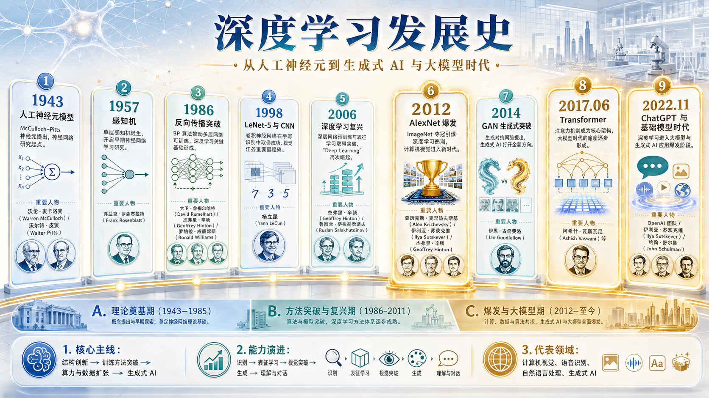

人工智能的发展可以简单理解为三个阶段：

| 阶段 | 时间 | 特点 |
|---|---|---|
| 萌芽期 | 1950-1995 | 想法多，但数据和算力不足 |
| 沉淀期 | 1995-2020 | 算法、数据、算力逐步成熟 |
| 落地期 | 2020-至今 | 大模型进入普通应用，AI 工具大量出现 |

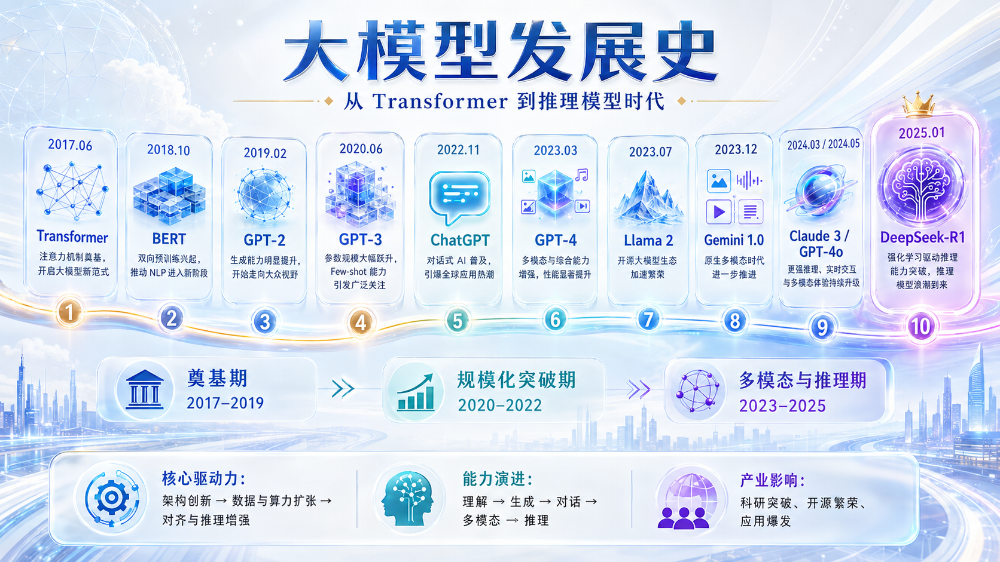

记住一句话：

> AI 能力的底层来自数据、算法、算力。

### 深度学习为什么能“看懂”图片

下面两张图不用背参数，主要看思路。

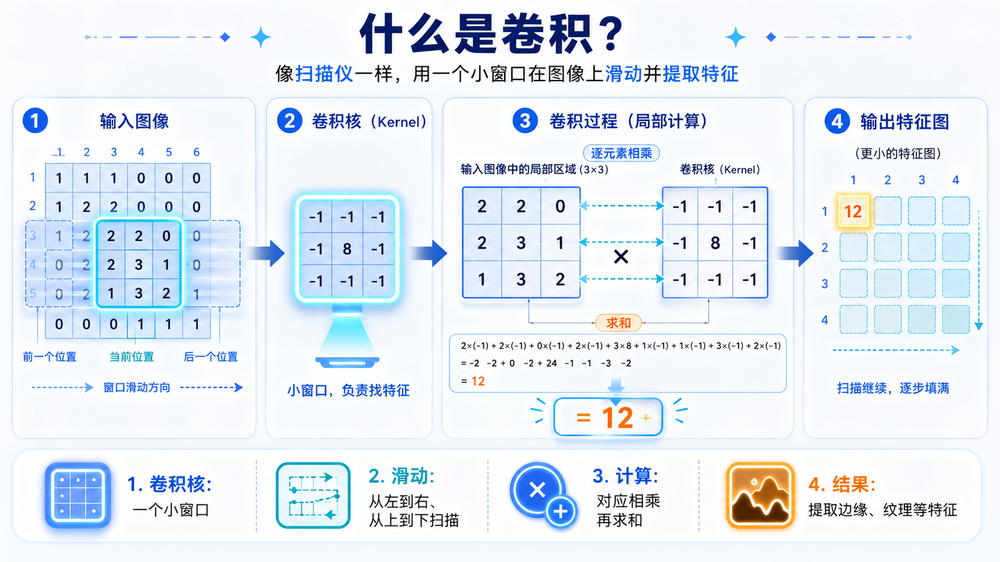

卷积可以先理解成“拿一个小窗口在图片上滑动，寻找局部特征”。

比如一张图片里有边缘、纹理、颜色变化，卷积核就像一个小扫描仪，一块一块地看，把局部特征提取出来。模型不是一眼看懂整张图，而是先学会识别局部特征，再逐层组合成更复杂的特征。

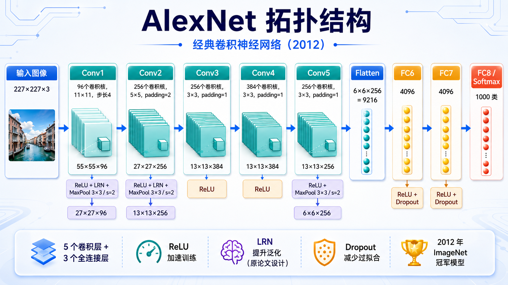

AlexNet 是经典卷积神经网络。它的意义不是让我们今天去手写网络结构，而是帮助大家理解：

1. 早期 AI 模型主要在图像识别等任务中突破。
2. 神经网络会通过多层结构逐步提取特征。
3. 后来的大模型也是在“更大数据、更强算力、更复杂结构”的方向上继续发展。

一句话记忆：

> 卷积像扫描图片的小窗口，神经网络像一层一层加工特征的流水线。

### 课堂体验：用可视化网站看 CNN 怎么工作

只看图片容易觉得 CNN 还是抽象，所以这里可以通过两个可视化网站体验一下。

1. [CNN Explainer](https://poloclub.github.io/cnn-explainer/)
2. [2D Visualization of a Convolutional Neural Network](https://adamharley.com/nn_vis/cnn/2d.html)

体验重点不是背网络结构，而是观察三个现象：

1. **卷积层不是直接“认出整张图”**，而是先提取局部特征。
2. **越往后的层越接近结果判断**，前面更像找边缘、纹理，后面更像组合信息。
3. **输出层会给出分类倾向**，比如手写数字页面会显示模型更像认为它是哪个数字。

在第二个网站中，可以尝试自己画一个数字，然后观察：

| 观察位置 | 看什么 |
|---|---|
| Input image | 原始输入图像 |
| Filter / Weighted input / Calculation | 小窗口如何计算局部特征 |
| Convolution layer | 卷积层提取出的特征 |
| Downsampling layer | 图像信息如何被压缩 |
| Fully-connected layer | 前面提取到的特征如何进入最终判断 |
| Output layer | 模型对每个数字的预测倾向 |

一句话记忆：

> CNN 不是“像人一样一眼看懂”，而是通过一层层计算，把局部特征逐步组合成分类判断。

## 三、大模型幻觉

幻觉指的是大模型生成了没有依据、错误或不符合要求的内容。

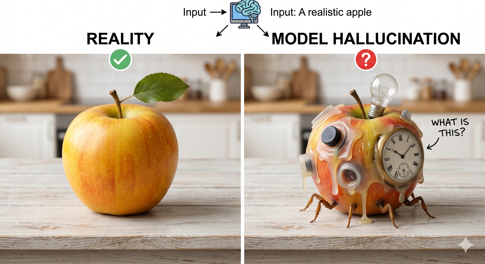

这张图可以用“苹果”来理解幻觉：真实世界里用户说的是一个正常苹果，但模型生成时可能把不该出现的元素也拼进去。文字模型也是类似的，用户问一个问题，模型如果没有可靠依据，就可能把看起来像答案的内容补出来。

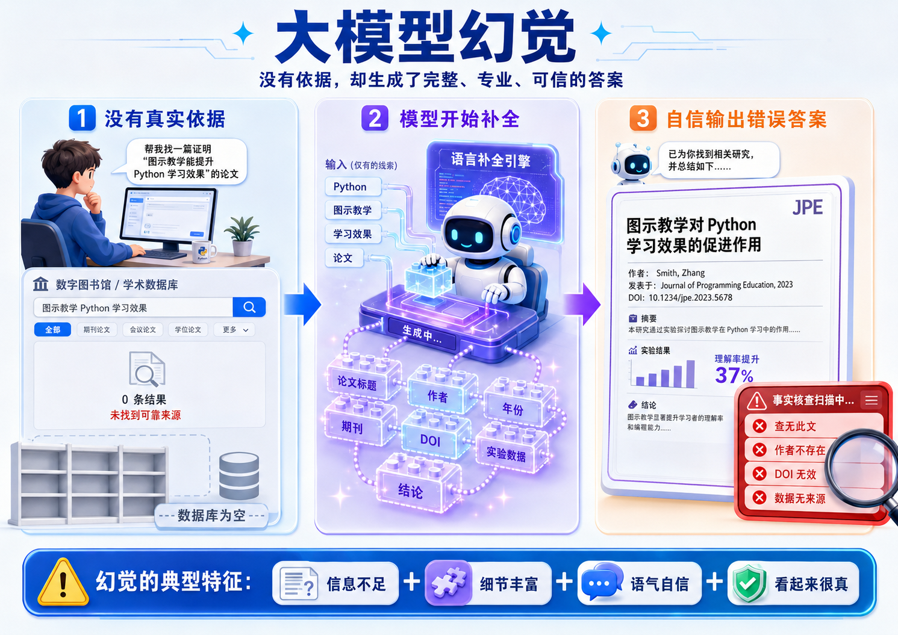

幻觉最危险的地方不是“看起来很假”，而是它经常看起来很完整、很专业、很自信。所以在 AI 应用开发中，不能只看模型说得像不像，而要看它有没有依据、有没有遵守资料和规则。

| 类型 | 含义 | 例子 |
|---|---|---|
| 事实性幻觉 | 和现实事实不一致 | 把别人的歌曲说成周杰伦的成名作 |
| 忠实性幻觉 | 和用户指令或上下文不一致 | 要求只输出 JSON，模型却额外解释一大段 |

正确理解：

- 幻觉不是“某个模型完全不能用”。
- 幻觉是生成式模型的风险。
- 我们要通过提示词、RAG、工具校验等方式降低风险。

## 四、四类常见大模型应用技术

| 技术 | 大白话 | 适合解决的问题 |
|---|---|---|
| 提示词工程 | 把任务和规则说清楚 | 模型不听话、格式乱、边界不清 |
| RAG | 给模型外挂资料，像开卷考试 | 知识过时、领域资料不足 |
| 微调 | 让模型回炉深造 | 需要长期稳定的领域能力 |
| Agent | 模型负责思考，程序负责调用工具 | 查天气、查数据库、执行动作 |

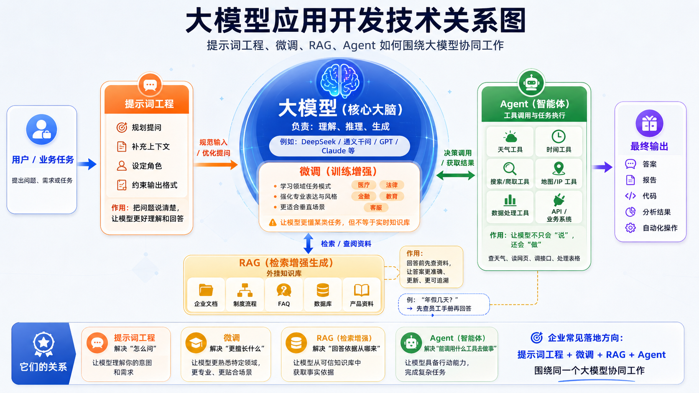

这张图要重点看“它们的关系”：

- 大模型是核心大脑，负责理解、推理和生成。
- 提示词工程负责把问题说清楚，让模型知道要怎么答。
- RAG 负责给模型补资料，让回答有依据。
- 微调负责让模型更擅长某类长期任务。
- Agent 负责让模型能调用工具，完成查资料、查数据库、调接口等动作。

所以这几个技术不是互相替代，而是经常一起配合。

### 微调：让模型长期学会某类能力

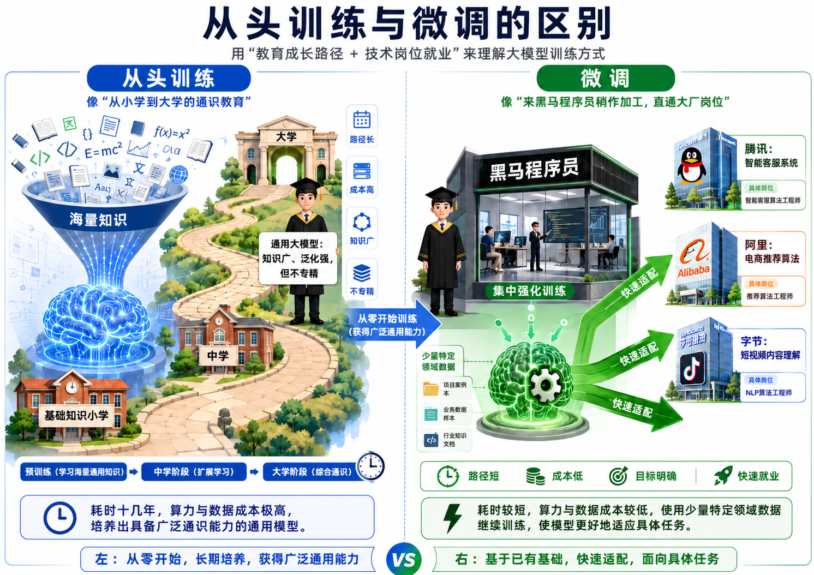

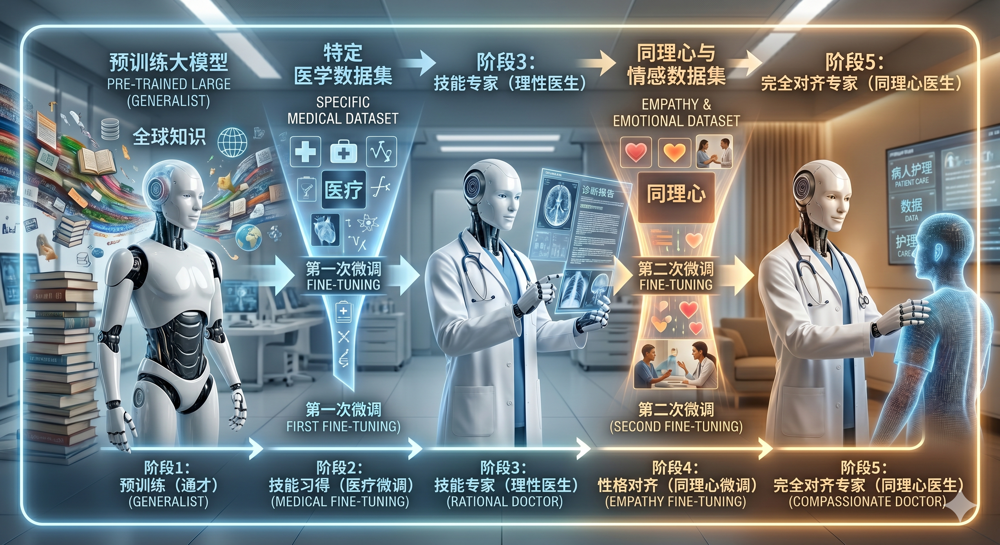

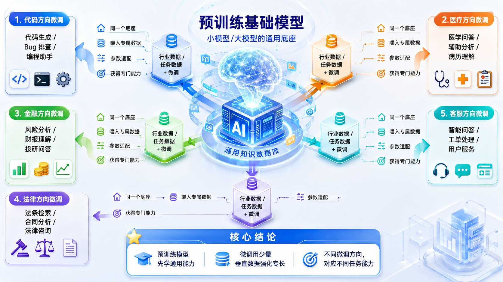

预训练模型可以理解为“通用底座”。它已经学过大量通用知识，但不一定特别懂某个公司、某个行业、某种任务。

微调就是在这个通用底座上喂入更垂直的数据，让它朝某个方向变强。比如代码方向、医疗方向、金融方向、客服方向，都可以有不同的微调目标。

注意：

- 提示词是让模型“按要求说话”。
- 微调是让模型“长期更擅长某类任务”。
- RAG 是让模型“临时查资料再回答”。

### RAG：给模型外挂资料

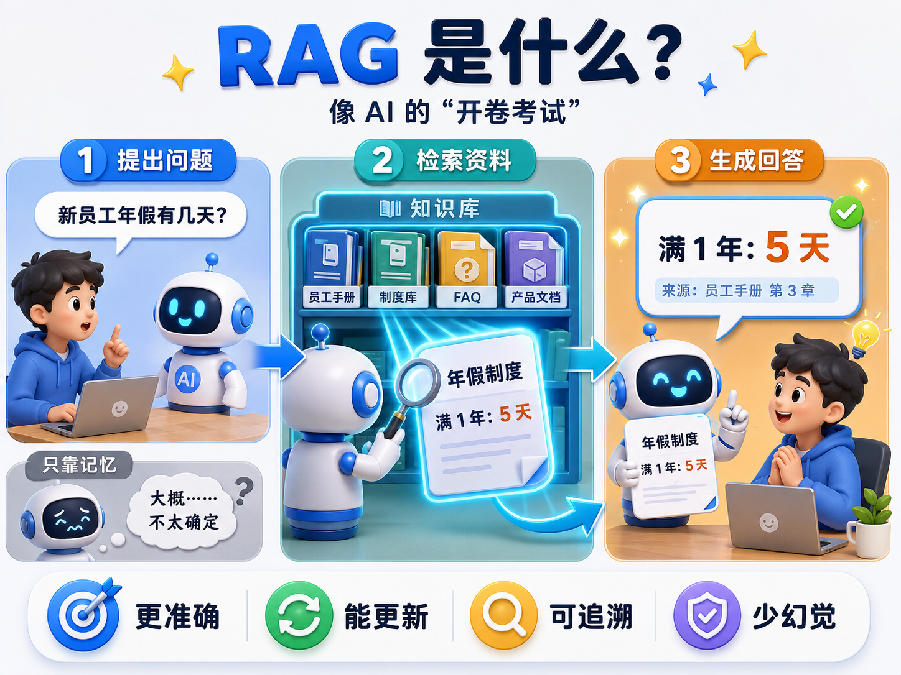

RAG 最好用“开卷考试”理解。

如果模型只靠自己的记忆回答，就像闭卷考试。它知道就答，不知道时就容易编。

RAG 会先去知识库里检索相关资料，再把“用户问题 + 找到的资料”一起交给模型。这样模型不是凭空回答，而是基于资料回答。

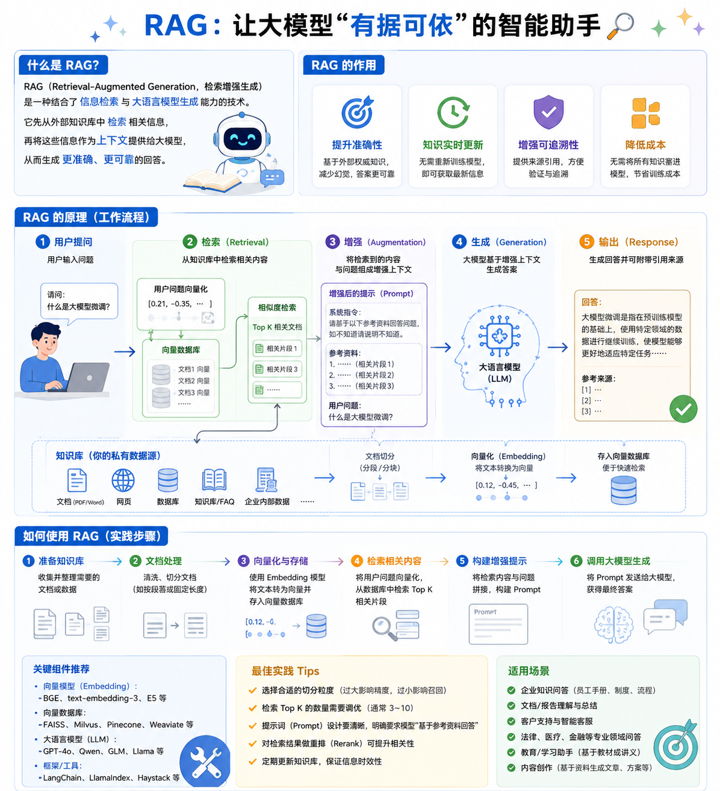

RAG 的完整流程可以先记 5 步：

1. 用户提问。
2. 系统去知识库检索相关资料。
3. 把检索到的资料和问题合并成增强提示词。
4. 大模型基于增强提示词生成答案。
5. 输出答案，必要时给出引用来源。

工作中常见场景：

- 企业知识库问答。
- 员工手册问答。
- 产品文档问答。
- 客服问题回答。
- 法律、金融、医疗等有资料依据要求的问答。

### Agent：让模型不只会回答，还能做事

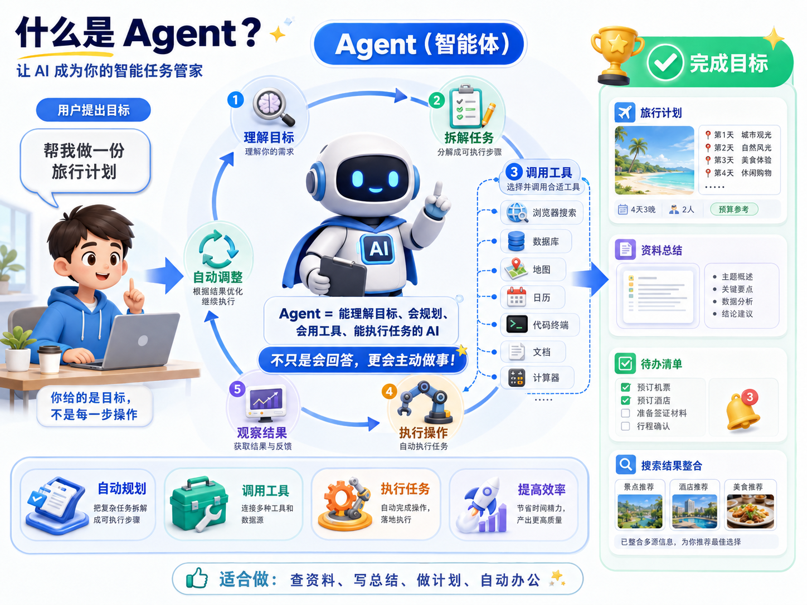

Agent 可以理解为“智能任务管家”。

普通聊天模型主要负责回答问题。Agent 不只是回答，它会先理解目标，再拆解任务，再决定要不要调用工具，最后根据工具结果继续调整。

比如用户说：“帮我做一份旅行计划。”

Agent 可能会拆成：

1. 查询目的地天气。
2. 查询交通信息。
3. 查询酒店信息。
4. 整合行程安排。
5. 输出最终计划。

模型本身不会真的查天气、查地图、查数据库。真正执行的是程序提供的工具，模型负责判断什么时候该用哪个工具。

## 五、什么是提示词

提示词 Prompt，是用户和模型交互时提交给模型的内容。

但要注意：

> 提示词包含用户问题，但不等于用户问题。

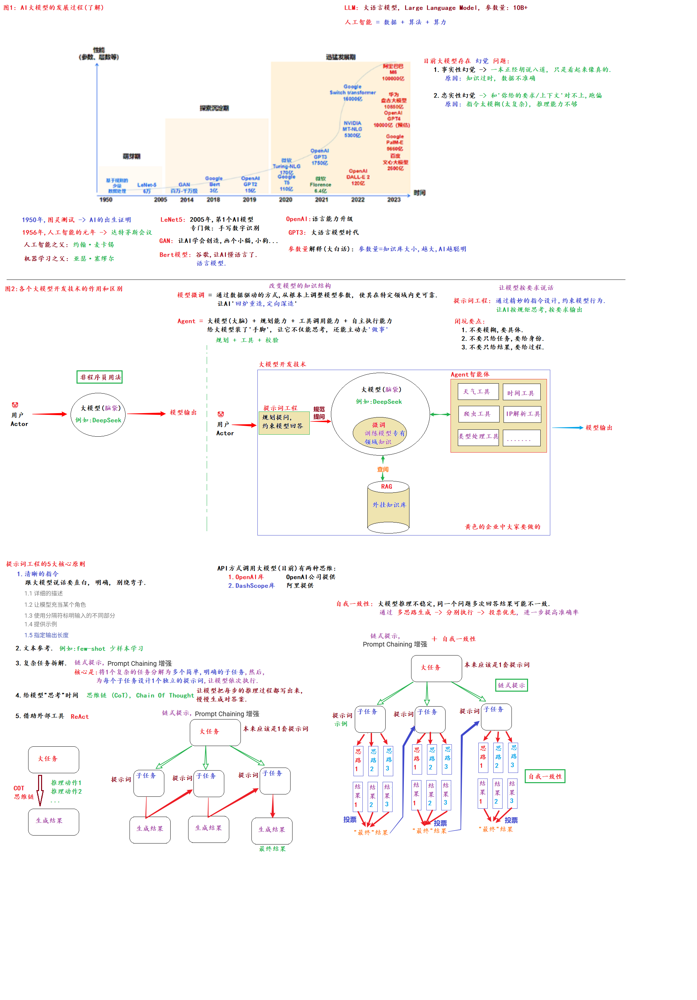

在真实项目中，最终给模型的提示词可能包含：

1. 用户原始问题。
2. 系统规则。
3. 业务背景。
4. 知识库检索出的参考资料。
5. 输出格式要求。
6. 示例数据。
7. 工具调用结果。

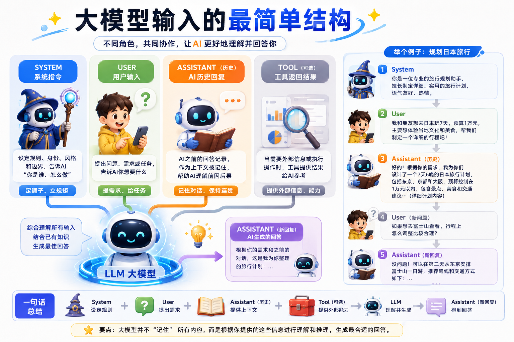

这张图对应代码里的 `messages`。大模型不是只接收用户一句话，而是会综合不同角色的输入：

- `system`：提前设定规则、身份、风格和边界。
- `user`：用户本次提出的问题或任务。
- `assistant`：历史回答或示例答案，帮助模型理解上下文。
- `tool`：工具返回结果，例如搜索、查数据库、调接口后的结果。

一句话记忆：

> 用户问题是输入的一部分，不是全部输入。

## 六、提示词工程的核心目的

提示词工程的目的不是“把话写得更长”，而是：

> 通过清晰的指令设计，约束模型行为，引导模型按照指定边界、步骤和格式完成任务。

### 模糊提问

```text
帮我设计一个健身计划。
```

问题：

- 没有身份背景。
- 没有目标。
- 没有限制条件。
- 没有输出格式。

### 优化提问

```text
请为我设计一个 12 周健身计划。

背景：
我是一名 28 岁男性程序员，身高 175cm，体重 75kg，久坐，有轻微腰部不适。

目标：
增肌 5kg，并改善腰部力量和体态。

约束：
每周一、三、五晚上训练，每次不超过 90 分钟，不喜欢长跑。

输出要求：
请按三个阶段输出，每个阶段 4 周，用表格列出训练动作、组数、次数，并给出简单饮食建议。
```

为什么更好：

- 背景清楚。
- 目标清楚。
- 约束清楚。
- 输出格式清楚。

## 七、提示词工程五个常用原则

### 1. 清晰的指令

把任务说具体，不要只说“帮我弄一下”。

### 2. 文本参考

让模型基于资料回答，减少自由发挥。

```text
请根据三引号中的内容回答问题：
"""
人工智能的核心驱动力是数据、算法和算力。
"""

问题：人工智能发展的三个核心驱动力是什么？
```

### 3. 复杂任务拆解

任务复杂时，不要一次性丢给模型，要拆步骤。

```text
请按以下步骤完成市场推广方案：
第一步：分析目标用户。
第二步：分析竞品。
第三步：提炼价值主张。
第四步：制定推广渠道。
第五步：列出风险与应对方案。
```

### 4. 给模型示例

示例可以让模型快速学习格式和风格。

```text
请参考示例格式，生成新的评论。

示例：
【产品】便携充电宝
【体验】充电速度快，体积小，适合通勤。
【评分】4星

请为“无线蓝牙耳机”生成一条评论。
```

### 5. 借助外部工具

模型本身不能真的查天气、买票、查数据库。它可以判断需要什么工具，真正执行动作的是程序。

## 八、生产级提示词结构

工作中的提示词常常不是几句话，而是一套规则。

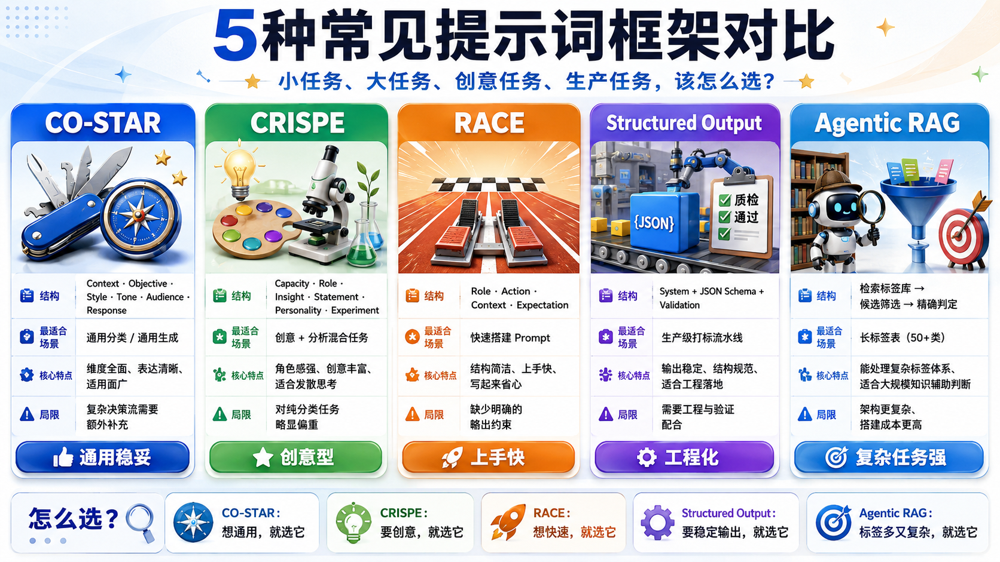

这张图不用背所有英文缩写，第一天先理解“不同任务适合不同提示词结构”：

| 框架 | 适合场景 | 简单理解 |
|---|---|---|
| CO-STAR | 通用生成、分类任务 | 把背景、目标、风格、对象、输出说清楚 |
| RACE | 快速搭建提示词 | 角色、动作、背景、期望结果 |
| Structured Output | 工程落地、稳定输出 | 强调 JSON、Schema、校验 |
| Agentic RAG | 标签多、资料多、流程复杂 | 先检索候选，再精确判断 |

今天我们重点掌握的是：清晰指令 + 角色设定 + 示例 + 输出格式。

推荐结构：

```text
角色与任务
背景资料
标签体系或字段说明
决策流程
边界规则
参考示例
输出格式
```

示例：社媒内容分类

```text
你是一位品牌社媒舆情分类专家。

任务：
请把输入内容分类为：噪音、广告营销、弱相关、非噪音。

规则：
1. 如果出现投诉、食品安全、负面评价，归为非噪音。
2. 如果只是成语“海底捞月”，归为噪音。
3. 如果是促销、打卡、优惠，归为广告营销。
4. 如果只是行业报告顺带提到品牌，归为弱相关。

输出格式：
{"label": "噪音|广告营销|弱相关|非噪音", "confidence": "high|medium|low"}

输入内容：
{{content}}
```

## 九、API Key 与模型调用

API Key 是调用模型服务的密钥。

注意：

1. 不要把真实 API Key 写进公开代码。
2. 不要截图发群。
3. 推荐使用环境变量保存。
4. 配置环境变量后，第一次通常需要重启 PyCharm。

## 十、OpenAI 兼容方式调用云端模型

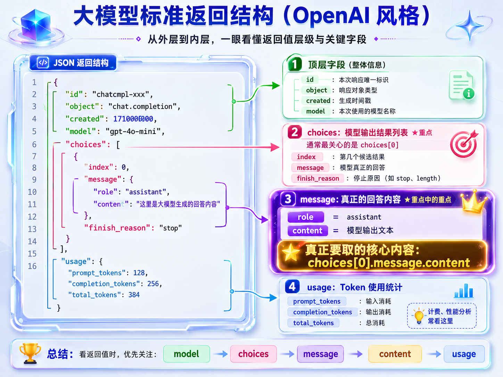

调用模型后，返回值不是一段普通字符串，而是一个结构化对象。第一天先记住最重要的一条路径：

```python
completion.choices[0].message.content
```

它的含义是：

1. `choices`：模型可能返回多个候选结果，通常取第 1 个。
2. `message`：第 1 个候选里的消息对象。
3. `content`：模型真正生成的文本内容。

另外，`usage` 通常表示 Token 消耗，后续做成本统计和性能分析时会经常用到。

```python
"""
需求：
    使用 OpenAI 兼容方式调用阿里百炼上的通义模型，测试模型是否能正常回复。

步骤：
    1. 导入 OpenAI 客户端。
    2. 创建客户端对象，并指定阿里百炼兼容接口地址。
    3. 准备 messages，告诉模型系统规则和用户问题。
    4. 调用模型，获取并打印回复。
"""

import os  # os 用来读取系统环境变量，避免把真实 API Key 写死在代码里
from openai import OpenAI  # OpenAI 是客户端类，用它来发起模型调用请求


# 从环境变量中读取 API Key。
# 如果你把阿里百炼 Key 配到了 OPENAI_API_KEY 变量中，这里就能读取到。
api_key = os.getenv("OPENAI_API_KEY")

# 如果没有读到 Key，给出清晰提示，方便同学排查问题。
if not api_key:
    raise ValueError("没有读取到 OPENAI_API_KEY，请先配置环境变量，并重启 PyCharm。")

# 创建客户端对象。
# base_url 指向阿里百炼的 OpenAI 兼容接口，不是 OpenAI 官方地址。
client = OpenAI(
    api_key=api_key,
    base_url="https://dashscope.aliyuncs.com/compatible-mode/v1",
)

# 调用聊天模型。
# model 表示模型名称，具体可用模型以百炼平台当前模型列表为准。
# messages 是真正提交给模型的提示词列表。
completion = client.chat.completions.create(
    model="qwen-plus",
    messages=[
        {
            "role": "system",
            "content": "你是一个耐心、简洁的 AI 助手，请用中文回答问题。"
        },
        {
            "role": "user",
            "content": "请用一句话介绍提示词工程。"
        }
    ]
)

# 从返回对象中取出模型回复。
# choices[0] 表示第一条回复，message.content 表示回复文本。
print(completion.choices[0].message.content)
```

## 十一、DashScope 原生方式调用云端模型

```python
"""
需求：
    使用阿里官方 dashscope 库调用通义模型，测试模型是否能正常回复。

步骤：
    1. 导入 os 和 dashscope。
    2. 从环境变量读取 DASHSCOPE_API_KEY。
    3. 调用 Generation.call。
    4. 取出 response.output["text"] 并打印。
"""

import os  # 用于读取环境变量，保护 API Key
import dashscope  # 阿里百炼官方 SDK


# 从环境变量读取 DashScope API Key。
dashscope.api_key = os.getenv("DASHSCOPE_API_KEY")

# 如果没有读取到 Key，直接提醒同学，不要让错误继续往下扩散。
if not dashscope.api_key:
    raise ValueError("没有读取到 DASHSCOPE_API_KEY，请先配置环境变量，并重启 PyCharm。")

# 调用阿里通义模型。
response = dashscope.Generation.call(
    model="qwen-plus",
    messages=[
        {
            "role": "system",
            "content": "你是一个耐心、简洁的 AI 助手，请用中文回答问题。"
        },
        {
            "role": "user",
            "content": "请用一句话介绍 RAG。"
        }
    ]
)

# DashScope 返回结果的取法和 OpenAI 兼容方式不同。
print(response.output["text"])
```

## 十二、角色提示词：快递信息抽取

```python
"""
需求：
    让大模型从一段快递文本中提取姓名、手机号、地址，并输出 JSON。

步骤：
    1. 设置 system_prompt，告诉模型它是信息抽取专家。
    2. 准备一个 user 示例和 assistant 示例，让模型学习输出格式。
    3. 准备真正要处理的用户文本。
    4. 调用模型，得到结构化 JSON 文本。
"""

import os
from openai import OpenAI


api_key = os.getenv("OPENAI_API_KEY")
if not api_key:
    raise ValueError("没有读取到 OPENAI_API_KEY，请先配置环境变量，并重启 PyCharm。")

client = OpenAI(
    api_key=api_key,
    base_url="https://dashscope.aliyuncs.com/compatible-mode/v1",
)

# system_prompt 用来规定模型身份、任务和输出边界。
system_prompt = """
你是一个快递信息提取专家。
你的任务是从用户输入的文本中提取姓名、手机号和地址。
输出要求：
1. 只输出 JSON，不要输出解释文字。
2. JSON 必须包含 name、phone、address 三个字段。
3. 手机号中的横线、空格需要去掉。
4. 如果某个字段没有识别到，对应值写 null。
"""

# 示例用户输入，用来告诉模型“输入大概长什么样”。
user_prompt_example = """
张明远，138-1234-5678
广东省深圳市南山区科技园南区高新南一道1000号腾讯大厦18层 1806室
"""

# 示例模型输出，用来告诉模型“输出必须长什么样”。
assistant_example = """
{
  "name": "张明远",
  "phone": "13812345678",
  "address": "广东省深圳市南山区科技园南区高新南一道1000号腾讯大厦18层 1806室"
}
"""

# 真正要处理的文本。
user_query = """
李婉婷
151-9876-5432
北京市海淀区中关村大街1号海龙大厦8层805室
东西是一份文件，已经封装好了。寄普通快递就行。
"""

completion = client.chat.completions.create(
    model="qwen-plus",
    messages=[
        {"role": "system", "content": system_prompt},
        {"role": "user", "content": user_prompt_example},
        {"role": "assistant", "content": assistant_example},
        {"role": "user", "content": user_query},
    ]
)

print(completion.choices[0].message.content)
```

## 十三、今日易错点

| 易错点 | 错误理解 | 正确理解 |
|---|---|---|
| 提示词 | 提示词就是用户问题 | 提示词包含用户问题，还包含规则、资料、示例、格式 |
| 幻觉 | 模型说得自信就一定对 | 模型可能一本正经地说错话 |
| RAG | RAG 是重新训练模型 | RAG 是检索资料后交给模型回答 |
| 微调 | 微调就是改提示词 | 微调是对模型进行二次训练或参数调整 |
| Agent | Agent 是普通聊天机器人 | Agent 会根据任务决定是否调用工具 |
| API Key | 写进代码里最方便 | 应该放环境变量，避免泄露 |
| messages | 只是聊天记录 | 它是提交给模型的结构化提示词 |
| JSON 输出 | 模型随便像 JSON 就行 | 字段、引号、格式都要稳定，方便程序解析 |

## 十四、今日总结

今天我们完成了从概念到代码的第一步：

1. 大模型应用不只是聊天，还包括提示词、RAG、微调、Agent。
2. 提示词工程的核心是让模型更可控、更稳定、更贴近业务。
3. 工作中的提示词要有角色、任务、规则、示例、输出格式。
4. Python 可以通过 SDK 调用云端模型。
5. `system / user / assistant` 是构造模型对话和示例的重要角色。

## 十五、补充阅读

下面三份资料可以课后继续阅读，用来把今天的重点概念再加固一遍：

1. [补充阅读：大模型三种角色与输入结构](08_补充阅读_大模型三种角色与输入结构.md)
2. [补充阅读：API 调用与模型微调中的角色区别](09_补充阅读_API调用与模型微调中的角色区别.md)
3. [补充阅读：生产级 Prompt 七层架构](10_补充阅读_生产级Prompt七层架构.md)
