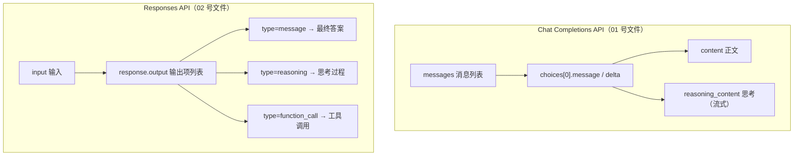

# Completions API 与 Responses API 对比说明

> **Day01 补充材料**  
> 对应代码：`06_代码/Day_01/01_openai方式调用大模型.py`（Chat Completions）  
> 对应代码：`06_代码/Day_01/02_response_api.py`（Responses API）

---

## 一、这两个名字是什么意思？

它们指的是**两套不同的大模型 HTTP 调用接口**，都由 OpenAI 定义规范，国内厂商（如阿里云百炼）提供「兼容模式」以便复用 OpenAI SDK。

| 接口名称 | SDK 调用写法 | 你们课上的示例文件 |
|----------|-------------|-------------------|
| **Chat Completions API**（聊天补全） | `client.chat.completions.create(...)` | `01_openai方式调用大模型.py` |
| **Responses API**（响应式任务） | `client.responses.create(...)` | `02_response_api.py` |

### 常见混淆：Completions 其实有三代

| 名称 | 输入方式 | 现状 |
|------|----------|------|
| Completions API（旧） | 单段 `prompt` 字符串 | 已基本淘汰 |
| **Chat Completions API** | `messages` 消息列表 | **当前最常用**，下文简称 Completions |
| **Responses API** | `input` 输入项 | OpenAI 2025 后主推的新接口 |

下文中的 **Completions** 均指 **Chat Completions API**。

---

## 二、一句话理解

| 接口 | 比喻 | 核心思路 |
|------|------|----------|
| **Completions API** | 发微信聊天 | 你发 `messages` 列表，模型回一条 `message` |
| **Responses API** | 提交一次任务 | 你发 `input`，模型回一个 `response`，内含多种结构化 **Item** |

---

## 三、整体流程对比



---

## 四、核心区别对照表

| 对比项 | Chat Completions API | Responses API |
|--------|---------------------|---------------|
| **输入参数** | `messages=[{role, content}, ...]` | `input="..."` 或结构化 item 数组 |
| **输出结构** | `choices[0].message.content` | `response.output`（多种 type 的 item 列表） |
| **思考过程** | 流式：`delta.reasoning_content` | 独立 item：`type == "reasoning"` |
| **多轮对话** | 客户端自行维护完整 `messages` 历史 | 可用 `previous_response_id` 链式引用，服务端存上下文 |
| **工具调用** | 支持 function calling，偏「聊天外挂」 | 原生支持 web search、文件检索、MCP 等 |
| **流式输出** | `choices[].delta` 增量文本 | 事件流（text delta、tool call 等分开推送） |
| **兼容地址（百炼）** | `.../compatible-mode/v1` | `.../api/v2/apps/protocols/compatible-mode/v1` |
| **适用场景** | 简单问答、多轮聊天、教学入门 | Agent、工具链、复杂推理、有状态工作流 |

---

## 五、用课上的代码看差异

### 5.1 Chat Completions（01 号文件）

```python
completion = client.chat.completions.create(
    model="qwen3.7-plus",
    messages=[{"role": "user", "content": "你是谁"}],
    extra_body={"enable_thinking": True},
    stream=True
)
# 从 chunk.choices[0].delta 里取 reasoning_content / content
```

**特点：**

- 输入是「角色 + 内容」的消息列表，适合多轮对话
- 输出通过 `choices[0].delta` 逐块读取
- 开启 `stream=True` 可实时打印，体验像「打字机」

### 5.2 Responses API（02 号文件）

```python
response = client.responses.create(
    model="qwen3.7-plus",
    input="9.9和9.11哪个大？",
    extra_body={"enable_thinking": False}
)
# 遍历 response.output，按 item.type 区分推理和答案
for item in response.output:
    if item.type == "reasoning":
        ...
    elif item.type == "message":
        ...
```

**特点：**

- 输入可以是简单字符串，也可以是结构化 item 数组
- 输出是 **item 列表**，每种 item 有明确的 `type`
- 一次响应可同时包含：思考、正式答案、工具调用结果等

---

## 六、输出结构详解

### Completions 的输出路径

```
completion
  └── choices[0]          # 候选回复（通常只有 1 个）
        └── message       # 完整回复（非流式）
        └── delta         # 增量片段（流式）
              ├── reasoning_content   # 思考过程
              └── content             # 正式正文
```

### Responses 的输出路径

```
response
  └── output[]            # 输出项列表（可能有多个 item）
        ├── type="reasoning"    # 思考过程
        │     └── summary[]     # 推理摘要
        ├── type="message"      # 最终答案
        │     └── content[]     # 正文片段
        └── type="function_call"  # 工具调用（Agent 场景）
```

---

## 七、记忆口诀（给同学）

| | Completions | Responses |
|---|-------------|-----------|
| **比喻** | 聊天记录 | 任务执行报告 |
| **输入单位** | 消息（message） | 输入项（input / item） |
| **输出单位** | 一条 assistant 消息 | 多个 output item |
| **谁管历史** | 你自己拼 `messages` | 可交给服务端（`previous_response_id`） |
| **学习顺序** | **先学**，最简单 | 做 Agent / 工具调用时再学 |

---

## 八、实际怎么选？

| 场景 | 推荐接口 | 理由 |
|------|----------|------|
| 学习提示词、简单问答、多轮聊天 | **Chat Completions** | 概念少、示例多、社区资料最丰富 |
| Coze 式 Agent、多工具、多步骤任务 | **Responses API** | 输出结构化，扩展性更好 |
| 需要服务端管理对话状态 | **Responses API** | 支持 `previous_response_id` 链式引用 |
| 已有项目、稳定运行中 | **Chat Completions** | 继续支持，无需强制迁移 |

OpenAI 官方态度：**Chat Completions 继续支持，但新项目更推荐 Responses**。阿里云百炼两套兼容模式均已提供，故 Day01 两个示例均可直接运行。

---

## 九、延伸阅读

- OpenAI 官方迁移指南：[Migrate to the Responses API](https://developers.openai.com/api/docs/guides/migrate-to-responses)
- 同目录补充材料：[提示词角色说明.md](./提示词角色说明.md)（Completions 中 `system` / `user` / `assistant` 的用法）

---

## 十、课堂小结

1. **Completions** = 聊天式接口，用 `messages` 输入，用 `choices[0].message` 或 `delta` 取输出。
2. **Responses** = 任务式接口，用 `input` 输入，用 `response.output` 按 `type` 解析多种结果。
3. 两者底层都是「把提示词发给大模型 → 拿回生成结果」，区别主要在**输入/输出的数据结构**和**扩展能力**。
4. 入门先掌握 Completions；后续做 Agent 与工作流时再深入 Responses。
