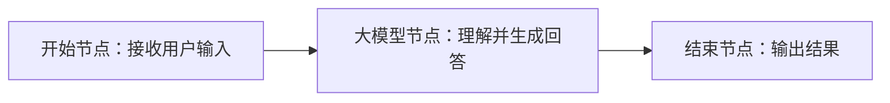
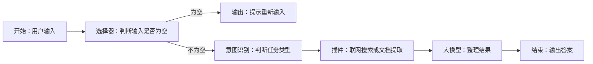
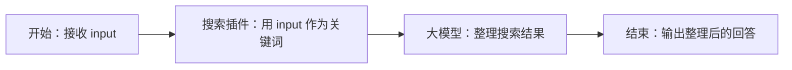
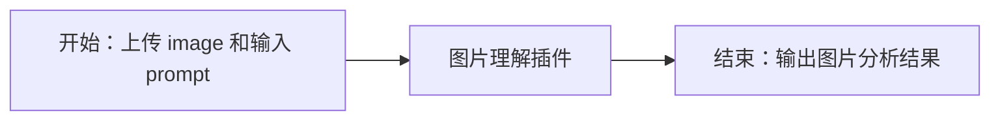
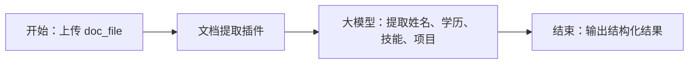

# Day04 Coze 智能体开发讲义

## 今日学习路线

今天学习 Coze 智能体开发，主线可以概括为：

智能体概念 -> Coze 平台结构 -> 工作流 -> 常见节点 -> 插件 -> 搭建第一个智能体。

学完之后，你要能回答四个问题：

1. 智能体和普通大模型聊天有什么区别？
2. Coze 里的资源库、工作流、插件分别做什么？
3. 工作流中常见节点应该怎么使用？
4. 如何把工作流变成智能体可以调用的工具？

## 一、智能体：让 AI 从“会回答”变成“会办事”

普通大模型聊天主要是“问答”。你问一句，它答一句。但真实工作中，我们经常希望 AI 能帮我们完成一个任务。

例如：

1. 上传一份简历，让 AI 提取技能、分析优缺点、生成面试建议。
2. 输入一个城市，让 AI 查询天气、推荐路线、整理旅游计划。
3. 输入一个网页链接，让 AI 读取内容并总结重点。
4. 输入一个用户问题，让 AI 判断是售前咨询、售后投诉还是闲聊。

这些任务不是只靠一句提示词就能稳定完成的。AI 需要先理解目标，再判断步骤，再调用工具，最后整理结果。这就是智能体要解决的问题。

智能体可以理解为：


一句话记忆：

大模型负责思考，工具负责行动，智能体负责把思考和行动串起来。

## 二、Coze 平台结构

Coze 是一个低代码智能体开发平台。低代码不是不需要技术，而是把很多底层代码操作变成了图形化配置，让我们先把智能体开发流程理解清楚。

Coze 中常见概念如下：

| 概念 | 作用 | 可以怎么理解 |
|---|---|---|
| 空间 | 隔离不同业务资源 | 公司里的不同业务部门 |
| 项目 | 组织一组具体 AI 功能 | 一个具体项目文件夹 |
| 资源库 | 存放可复用资源 | 团队共享工具箱 |
| 工作流 | 按步骤完成任务 | 一条任务流水线 |
| 插件 | 封装好的外部工具 | 别人写好的函数或 API |
| 知识库 | 存放文档知识 | 给模型外挂资料 |
| 数据库 | 存放业务数据 | 订单、商品、用户等结构化数据 |

要特别注意：资源库里的内容不是摆设。工作流、插件、知识库等资源，最终都要服务于智能体完成任务。

## 三、工作流：把任务拆成一条清楚路线

工作流就是一条任务流程。它从开始节点接收输入，中间经过不同节点处理，最后由结束节点输出结果。

最简单的工作流如下：



更接近真实任务的工作流如下：



工作流要注意三个点：

1. 数据从前往后流动。
2. 每个节点只负责一部分事情。
3. 每加一个节点都要测试一次。

不要等全部搭完再测试。流程越长，最后一起排错越困难。

## 四、常见节点

### 1. 开始节点

开始节点负责接收用户输入。最常见的变量叫 `input`。

如果用户输入的是一句话，类型通常是文本。如果用户上传图片或文档，就要把输入类型改成对应的文件类型。

示例：

| 任务 | 输入变量建议 | 类型建议 |
|---|---|---|
| 普通问答 | `input` | 文本 |
| 图片识别 | `image` | 图片文件 |
| 文档提取 | `doc_file` | 文档文件 |
| 旅游规划补充城市 | `city` | 文本 |

### 2. 大模型节点

大模型节点负责理解和生成。使用大模型节点时，最重要的是变量传递。

如果前面有一个用户输入变量 `input`，后面的大模型提示词中要写：

```text
请根据用户输入生成回答：
{{input}}
```

这里的 `{{input}}` 表示把用户输入的内容放到提示词里。只添加变量但不在提示词中引用，模型就看不到这份信息。

大模型节点常见用途：

1. 根据用户问题生成回答。
2. 判断用户是否缺少信息。
3. 对插件结果进行总结。
4. 按指定格式输出内容。

### 3. 选择器节点

选择器节点类似 Python 的 `if / else`，适合处理明确条件。

例如：

1. 用户输入为空：提示重新输入。
2. 用户上传文件为空：提示上传文件。
3. 查询结果为空：提示没有查到结果。

选择器节点适合“条件明确”的判断，不适合复杂语义理解。

### 4. 意图识别节点

意图识别节点用于判断用户想做什么。它更像一个语义分类器。

例如用户输入：

1. “帮我安排深圳三日游”
2. “我想周末去广州玩”
3. “去长沙旅游怎么安排”

这些表达不同，但都属于“旅游规划”意图。

意图识别节点通常会输出一个分类编号或分类名称。这个结果用于决定走哪条分支，但不要把分类编号当作用户问题传给大模型。

### 5. 输入节点

输入节点用于补充缺失信息。

例如用户只说：

```text
帮我规划一下旅游路线
```

这里缺少目的地。工作流可以通过输入节点追问：

```text
你想去哪个城市？
```

然后把用户补充的城市保存到 `city` 变量，再传给后续大模型节点。

注意：

1. 新变量不要继续叫 `input`，避免和原始输入冲突。
2. 后续节点要接收这个变量。
3. 提示词中要引用这个变量。

### 6. 插件节点

插件节点负责调用外部能力。插件可以理解为别人写好的函数。

常见插件：

1. 联网搜索：查询实时信息。
2. 天气查询：查询城市天气。
3. 图片理解：识别图片内容。
4. 文档提取：读取 PDF、Word、简历等文件内容。
5. 链接读取：读取网页内容。

使用插件时不要只看名字，要看它需要哪些输入参数、返回哪些输出字段。

### 7. 结束节点

结束节点决定最终给用户输出什么。结束节点不要随便选择字段，要确认你选择的是用户真正需要的结果。

常见错误：

1. 选择了模型的推理过程，而不是正式回答。
2. 选择了插件原始数据，用户看不懂。
3. 忘记把最后整理好的内容传到结束节点。

## 五、插件使用示例

### 示例 1：联网搜索

任务：用户输入一个问题，工作流联网搜索相关信息，并输出整理后的结果。

流程：



关键点：

1. 搜索插件的关键词参数要接收用户输入。
2. 搜索结果通常需要大模型整理后再输出。
3. 如果不知道插件输出选哪个字段，先运行测试，看日志和示例。

### 示例 2：图片理解

任务：上传图片，让 AI 分析图片内容。

流程：



关键点：

1. 图片变量类型要设置为图片文件。
2. prompt 用来告诉插件要分析什么。
3. 本地图片上传后，平台会把图片转成可访问的文件地址。
4. 如果某个插件效果不稳定，可以换同类插件或使用多模态大模型。

### 示例 3：文档提取

任务：上传一份简历，提取简历中的关键信息。

流程：



关键点：

1. 文档输入类型要选择文件或文档。
2. 插件先把文档内容提取成文本。
3. 大模型再基于文本做结构化分析。
4. 演示时使用脱敏资料，不上传真实隐私文件。

## 六、搭建第一个智能体

工作流做好之后，要发布，才能被智能体引用。

搭建智能体基本步骤：

1. 创建智能体，选择单 Agent。
2. 设置智能体名称，例如“求职资料助手”或“旅行规划助手”。
3. 写清楚智能体职责：它能做什么，不能做什么，遇到不确定信息怎么处理。
4. 添加工具，把已经发布的工作流加入智能体。
5. 设置开场白和预设问题。
6. 预览调试。
7. 保存并发布。

智能体提示词示例：

```text
你是一个求职与学习助手。
你可以根据用户需求选择合适工具：
1. 当用户需要规划旅行时，调用旅游规划工作流。
2. 当用户上传文档并希望提取内容时，调用文档提取工作流。
3. 当用户只是普通提问时，直接用简洁自然的语言回答。

回答时要结构清晰，不要编造工具没有返回的信息。
```

这段提示词的作用：

1. 告诉智能体身份。
2. 告诉智能体有哪些工具。
3. 告诉智能体什么时候调用哪个工具。
4. 约束智能体不要乱编。

## 七、调试清单

当结果不对时，按这个顺序检查：

1. 开始节点是否拿到了用户输入。
2. 变量是否传给了下一个节点。
3. 大模型提示词中是否引用了变量。
4. 选择器分支是否走对。
5. 意图识别分类是否合理。
6. 输入节点补充的信息是否继续传递。
7. 插件必填参数是否配置完整。
8. 插件输出字段是否选对。
9. 结束节点是否输出了正确结果。
10. 工作流是否已经发布。

## 八、今日重点总结

1. 智能体的核心是“大模型 + 工具”。
2. Coze 的核心不是按钮，而是资源、流程和工具编排。
3. 工作流负责把任务拆成稳定步骤。
4. 选择器处理明确条件，意图识别处理语义分类。
5. 输入节点用于补信息，不要让用户一次必须说全。
6. 插件让智能体拥有外部能力。
7. 工作流必须发布后，智能体才能稳定调用。
8. 调试时一定要看日志，不要只看最终回答。

## 九、自检问题

1. 我能不能用一句话解释智能体是什么？
2. 我能不能画出一个最简单的工作流？
3. 我能不能说清楚选择器和意图识别的区别？
4. 我能不能把搜索插件接入工作流？
5. 我能不能解释为什么工作流要发布？
6. 我能不能通过日志定位变量没传的问题？

