# Day05 Coze 进阶使用讲义

## 今日学习路线

今天学习 Coze 的进阶能力，重点不是认识更多按钮，而是让智能体具备三类更接近真实工作的能力：

1. 使用知识库：让智能体能根据我们提供的文档回答问题。
2. 使用数据库：让智能体能对结构化数据进行查询、新增、修改、删除。
3. 使用多模态：让智能体能处理图片、音频、视频等非文本内容。

可以把今天的内容理解成一句话：

智能体要真正做事，必须能访问业务数据，也必须能处理不同类型的数据。

## 一、知识库和数据库

知识库和数据库都属于私有数据访问，但它们的使用场景完全不同。

| 对比点 | 知识库 | 数据库 |
|---|---|---|
| 存什么 | 文档、资料、说明书、课程笔记 | 表格数据、业务记录 |
| 数据形态 | 一段段文本 | 一行行记录 |
| 主要操作 | 检索、召回、问答 | 增删改查 |
| 适合场景 | 公司制度问答、课程资料问答、产品说明问答 | 签到、绩效、订单、学生信息 |
| 常见节点 | 知识库检索节点 | 数据库节点 |

举例：

1. 大模型发展史 PDF：适合放知识库。
2. 学生签到表：适合放数据库。
3. 产品说明书：适合放知识库。
4. 员工绩效表：适合放数据库。

## 二、RAG：让模型根据资料回答

RAG 的核心流程是：

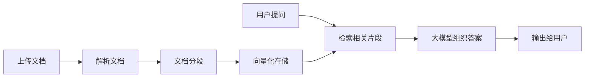

为什么需要 RAG？

1. 大模型不知道公司内部资料。
2. 大模型知识可能过时。
3. 大模型在不确定时可能编造。
4. 资料经常更新时，不适合每次都训练模型。

RAG 的好处是：资料放在知识库里，用户问问题时先查资料，再让模型回答。

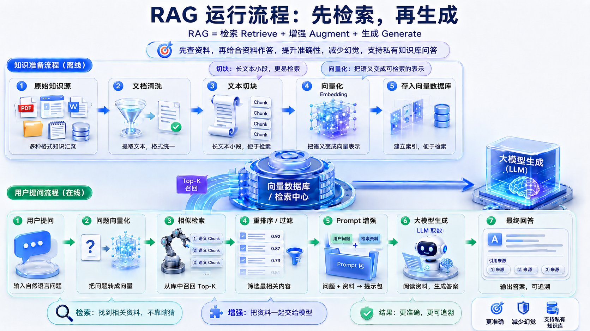

看图要点：RAG 分成离线准备和在线问答两段。离线阶段负责把资料变成可检索的知识单元，在线阶段负责根据用户问题召回资料，再交给大模型生成答案。

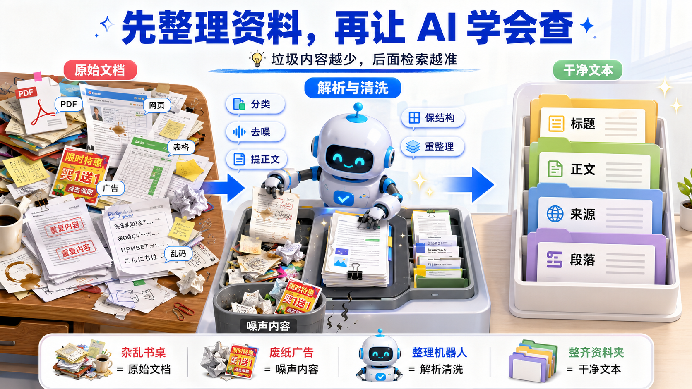

看图要点：看懂总流程以后，第一步要落到“处理数据”。原始资料往往格式杂、噪声多，知识库不是“把文件扔进去就完事”，而是要先把资料整理成 AI 容易检索的干净文本。

## 三、知识库创建步骤

创建知识库时，建议按下面步骤完成：

1. 进入资源库。
2. 新建知识库。
3. 选择知识库类型。
4. 上传文档。
5. 选择解析方式。
6. 配置分段方式。
7. 预览分段效果。
8. 在工作流中添加知识库检索节点。

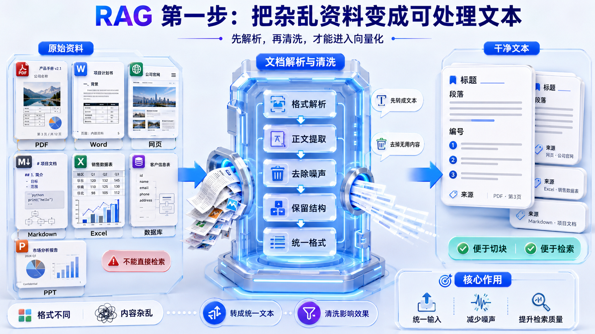

看图要点：PDF、Word、网页、Excel 等资料不能直接拿来检索，先要解析、提取正文、去除噪声、保留结构，最后统一成干净文本。

### 分段为什么重要

文档不是越完整地塞给模型越好。系统需要把长文档切成多个小片段，用户提问时再召回最相关的片段。

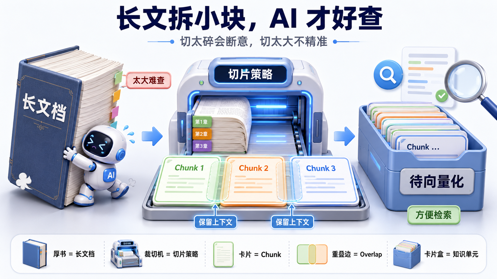

看图要点：长文档要切成 Chunk。Overlap 表示相邻切片保留少量重叠内容，目的是防止一句话或一个知识点刚好被切断。

如果分段太大：

1. 召回内容不精准。
2. 模型读到很多无关内容。
3. 回答可能变得啰嗦。

如果分段太小：

1. 上下文不完整。
2. 模型只看到半句话。
3. 回答容易断章取义。

所以分段要平衡：既不能太碎，也不能太粗。

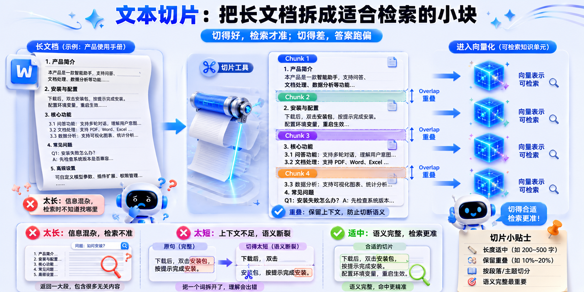

看图要点：切片质量会直接影响检索质量。切得太长，检索不准；切得太短，上下文不够；长度适中并保留重叠，效果更稳。

## 四、知识库检索节点参数

### 1. 检索策略

全文检索：按关键词找内容。优点是直接，缺点是换个说法可能找不到。

语义检索：按意思找内容。即使用户问法和文档原话不完全一样，只要意思接近，也可能召回。

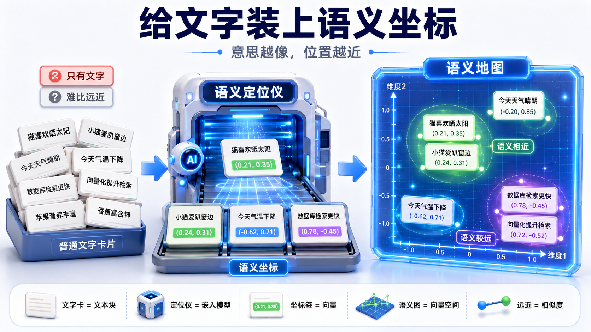

看图要点：向量化可以理解为“给文字装上语义坐标”。意思越接近，位置越近，所以模型可以按语义相似度找资料。

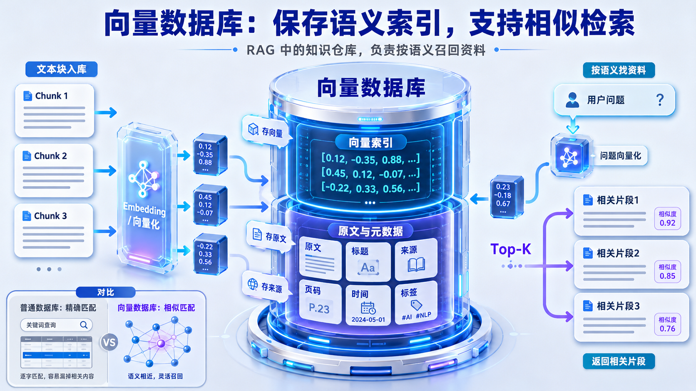

看图要点：向量数据库保存的不只是原文，还包括向量索引、标题、来源、页码等元数据。这样检索结果既能找到内容，也能保留来源。

混合检索：结合全文和语义，通常更稳。

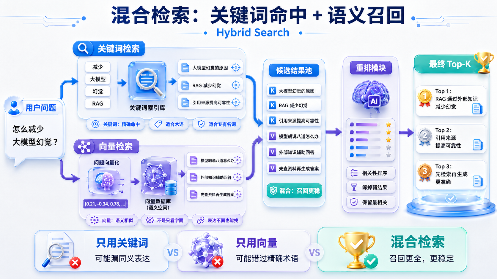

看图要点：关键词检索擅长精确命中，语义检索擅长找到相近表达。混合检索把两种方式放在一起，召回更全面、更稳定。


看图要点：可以把关键词检索理解为按书名、编号、关键词找书；把语义检索理解为按主题和相近意思找书。两种找法一起用，漏掉重要资料的概率更低。

### 2. 最大召回数量

最大召回数量表示最多返回几个片段。

不是越多越好。返回太多，模型会读到无关内容；返回太少，可能漏掉重要资料。

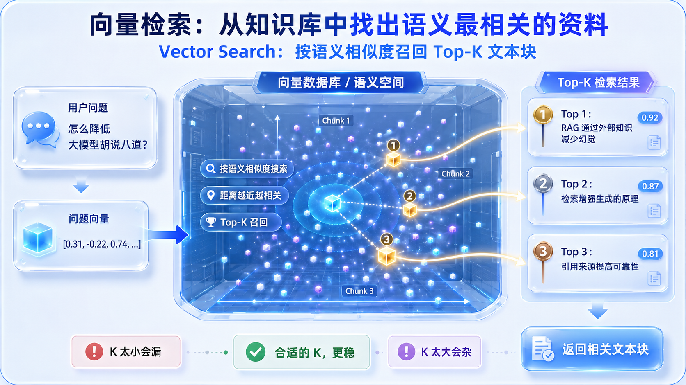

看图要点：Top-K 表示取最相关的前 K 个片段。K 太小会漏，K 太大会杂，实际要结合资料质量和回答效果调整。

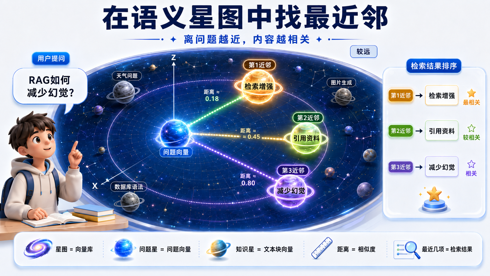

看图要点：语义检索可以想成在语义空间里找“离问题最近的知识点”。距离越近，通常越相关。

### 3. 最小匹配度

最小匹配度是召回门槛。

门槛太低：容易召回无关内容。

门槛太高：可能什么都找不到。

入门时可以先用 0.7 左右的思路理解，再根据效果调整。

### 4. 查询改写

查询改写会把用户原始问题改写得更适合检索。

例如：

```text
用户原问题：我之前看到那个模型发展史，BERT 和 GPT 到底差在哪？
改写后：BERT 和 GPT 的区别是什么？
```

### 5. 结果重排

结果重排会把召回结果重新排序，让更相关的片段排在前面。

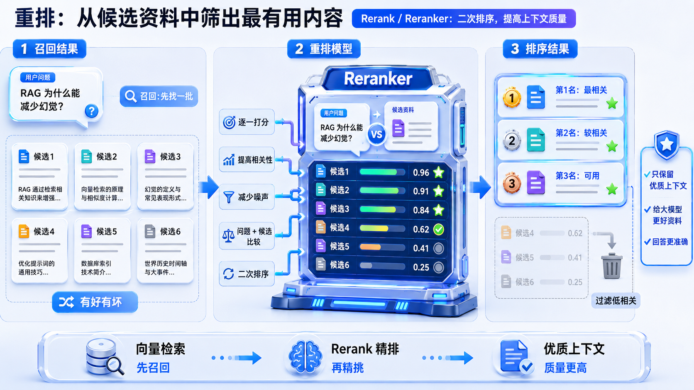

看图要点：第一次检索只是先召回一批候选资料，Rerank 会再筛一遍，把更相关、更高质量的内容排到前面。

## 五、知识库检索后为什么要润色

知识库检索出来的是原始片段，不一定适合直接给用户看。

更好的流程是：

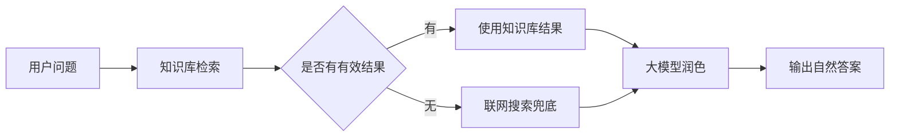

润色节点的作用：

1. 把原始片段整理成自然语言。
2. 去掉无关内容。
3. 按用户问题组织答案。
4. 在资料不足时说明限制。

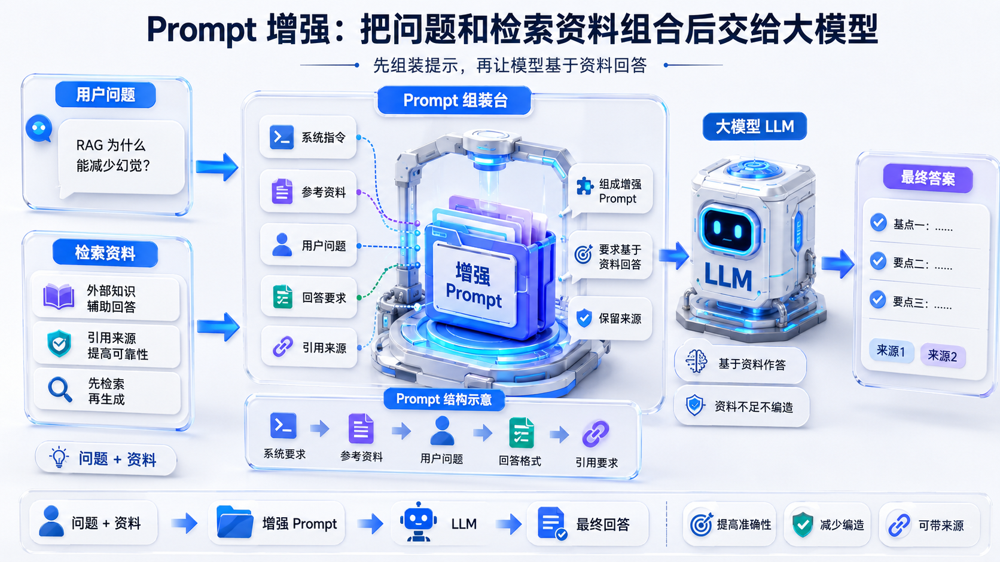

看图要点：Prompt 增强不是只把问题交给模型，而是把系统要求、用户问题、检索资料、回答格式和引用要求一起组装好，再让模型基于资料回答。

提示词可以这样写：

```text
你是一个资料问答助手。
请优先根据知识库内容回答用户问题。
如果知识库内容为空或明显不足，再参考联网搜索结果。
不要编造资料中没有的信息。

用户问题：
{{input}}

知识库内容：
{{knowledge_result}}

联网搜索结果：
{{web_result}}

请用清楚、简洁的中文回答。
```

这段提示词的重点：

1. 明确知识库优先。
2. 允许联网搜索兜底。
3. 禁止编造。
4. 最终输出自然语言。

## 六、Coze 数据库

数据库适合存结构化数据。结构化数据就是可以放进表格的数据。

例如绩效表：

| work_code | name | performance_level |
|---|---|---|
| 1001 | 张三 | A |
| 1002 | 李四 | B |
| 1003 | 王五 | C |

字段设计注意：

1. 字段名尽量使用英文或拼音，不要随便写。
2. 字段名要和导入 Excel 表头对应。
3. 工号虽然像数字，但更适合用字符串。
4. 测试数据和线上数据要分清楚。

## 七、数据库查询流程

查询数据时，不是直接把用户的话扔给数据库，而是先抽取查询条件。

流程：

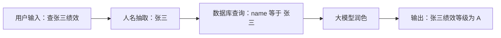

为什么需要人名抽取？

用户输入是自然语言，数据库需要明确条件。大模型节点可以先把自然语言里的关键信息提取出来。

为什么需要润色？

数据库返回的可能是原始列表或 JSON，用户不一定看得懂。润色节点把它变成自然语言。

## 八、数据库新增、修改、删除

### 1. 新增数据

流程：

```text
用户输入 -> 信息抽取 -> 新增数据节点 -> 输出新增结果
```

示例输入：

```text
新增员工乔峰，工号 666，绩效 S。
```

需要抽取：

1. 姓名：乔峰
2. 工号：666
3. 绩效等级：S

### 2. 修改数据

修改数据要分清两件事：

1. 用什么条件找到这条记录。
2. 把哪个字段改成什么值。

示例输入：

```text
把乔峰工号 666 的绩效改成 D。
```

定位条件：

1. name = 乔峰
2. work_code = 666

更新内容：

1. performance_level = D

### 3. 删除数据

删除数据只需要删除条件，但条件必须精确。

示例输入：

```text
删除乔峰工号 666 的记录。
```

删除条件：

1. name = 乔峰
2. work_code = 666

真实工作中删除要非常谨慎。很多业务不会直接删除，而是增加一个状态字段，例如 `is_deleted`，把它改成“已删除”。

## 九、多模态

多模态就是 AI 能处理多种数据类型。

| 模态 | 示例 | 常见任务 |
|---|---|---|
| 文本 | 问题、文章、简历 | 问答、总结、改写 |
| 图片 | 商品图、截图、海报 | 识别、生成、清晰度提升 |
| 音频 | 录音、语音消息 | 转文字、合成语音 |
| 视频 | 宣传片、课程视频 | 生成视频、分析视频 |

## 十、文生图

文生图就是用文字生成图片。

流程：

```text
输入提示词 -> 图像生成插件 -> 输出图片
```

好的提示词通常包含：

1. 主体：画面中最重要的对象。
2. 场景：在哪里。
3. 风格：写实、插画、科技感、国风等。
4. 细节：光线、角度、颜色、构图。
5. 限制：不要出现什么。

示例：

```text
生成一张写实风格的金毛犬图片，背景是雪地，金毛正在奔跑玩雪，阳光柔和，画面清晰，有自然景深，不要出现文字和水印。
```

## 十一、图片清晰度提升

图片清晰度提升用于处理低分辨率图片。

流程：

```text
上传图片 -> 清晰度提升插件 -> 输出增强图片
```

注意：

1. 开始节点输入类型要改成图片。
2. 图片上传完成后再运行。
3. 原图太差时，提升效果有限。
4. 插件通常会消耗积分。

## 十二、ASR 和 TTS

### ASR：语音转文字

ASR 全称 Automatic Speech Recognition，意思是语音识别。

流程：

```text
上传音频 -> ASR 插件 -> 输出文字 -> 大模型整理
```

适合：

1. 面试录音分析。
2. 会议纪要。
3. 课堂录音转写。
4. 客服通话分析。

常见问题：

1. 音频太长需要增加超时时间。
2. 录音噪音大会影响识别。
3. 识别结果可能没有标点，需要大模型整理。

### TTS：文字转语音

TTS 全称 Text-to-Speech，意思是语音合成。

流程：

```text
输入文本 -> TTS 插件 -> 输出音频
```

适合：

1. 广告配音。
2. 课程旁白。
3. 智能客服语音。
4. 短视频解说。

使用时要查看插件说明，因为不同插件对文本长度、音色、情绪、语速等参数要求不同。

## 十三、视频生成

视频生成可以根据文字或图片生成短视频。

常见参数：

1. 模型。
2. 分辨率。
3. 时长。
4. 种子值。
5. 提示词。

要知道它的边界：

1. 成本高。
2. 生成慢。
3. 手部、肢体、物理动作容易出错。
4. 复杂动作可能“一眼假”。

所以视频生成不是万能按钮。真实工作里通常会先生成多个版本，再筛选、剪辑、后期处理。

## 十四、AI 面试助手项目串联

今天的知识可以组合成一个 AI 面试助手。

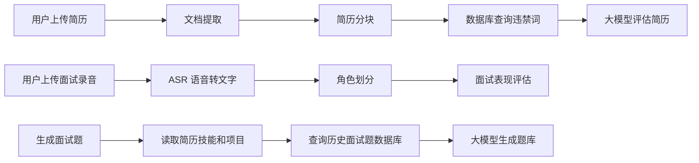

你会发现，真实项目不是单个节点能完成的，而是多个能力组合：

1. 文档提取负责把简历变成文本。
2. 数据库负责保存违禁词或历史面试题。
3. ASR 负责把录音变成文字。
4. 大模型负责理解、评估、生成报告。

## 十五、今日自检

1. 我能不能说清楚知识库和数据库区别？
2. 我能不能解释 RAG 为什么要先检索再生成？
3. 我能不能说明分段为什么影响检索效果？
4. 我能不能搭出知识库检索加大模型润色的流程？
5. 我能不能说明数据库查询前为什么要抽取实体？
6. 我能不能区分新增、更新、删除的关键配置？
7. 我能不能说出 ASR 和 TTS 的区别？
8. 我能不能说明视频生成为什么有成本和效果边界？
