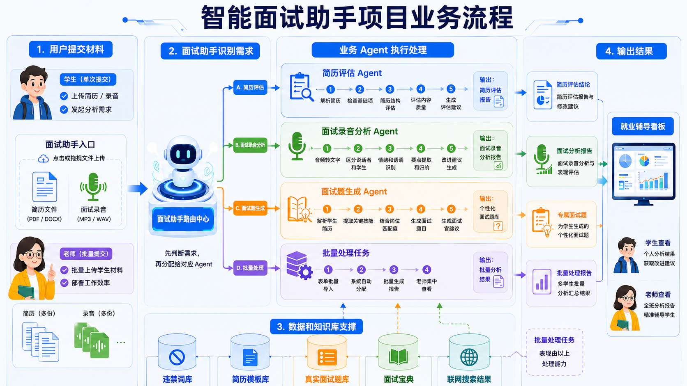
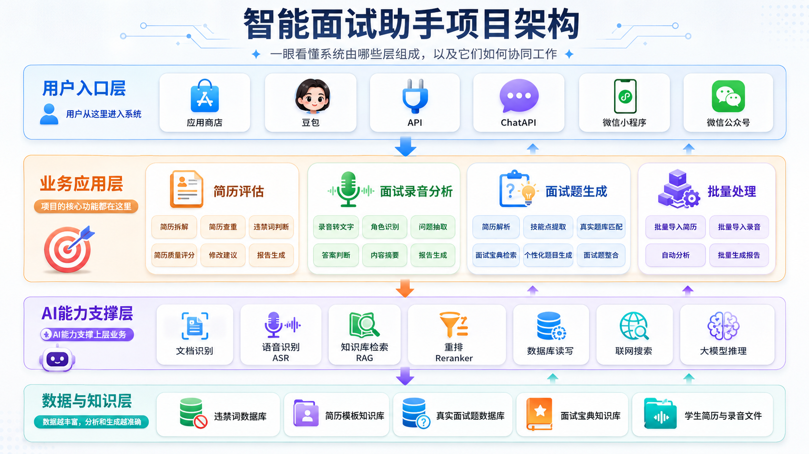
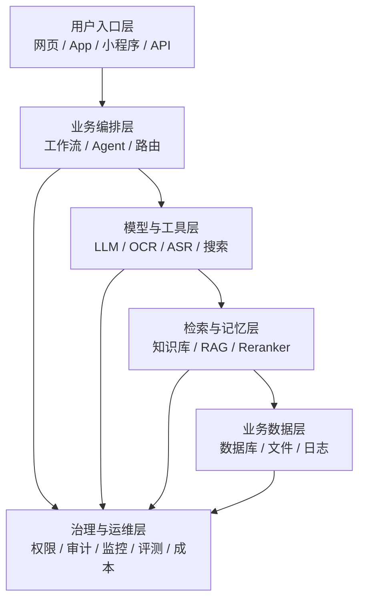
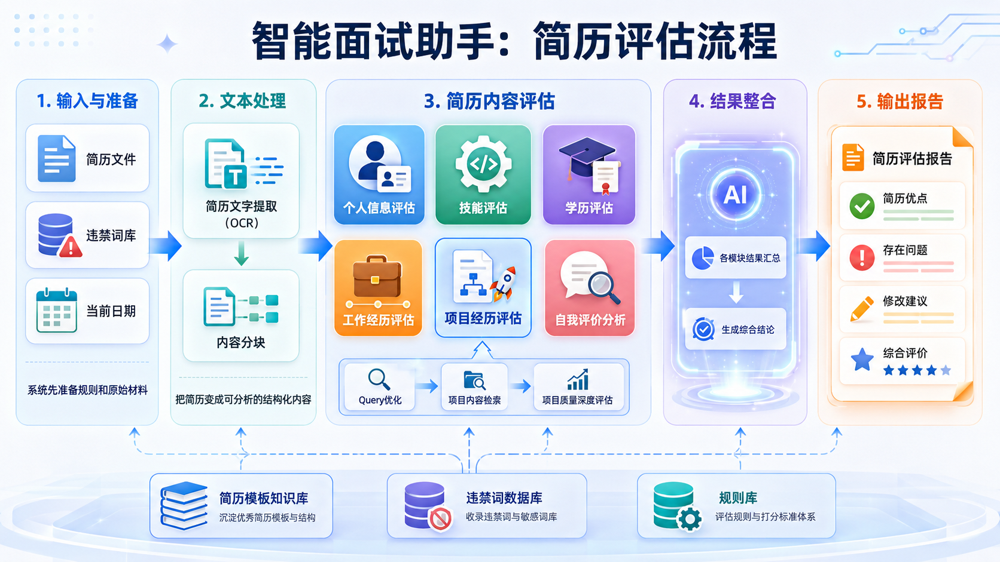
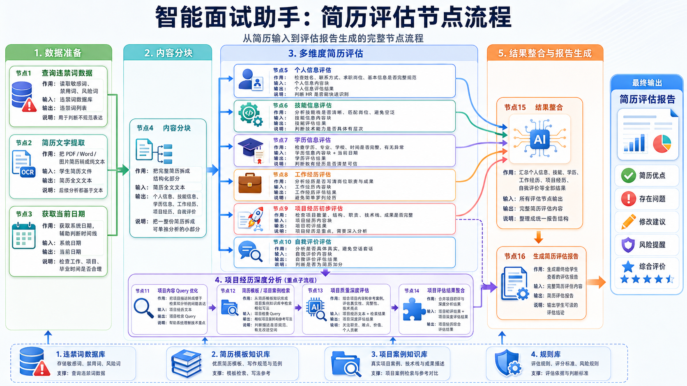
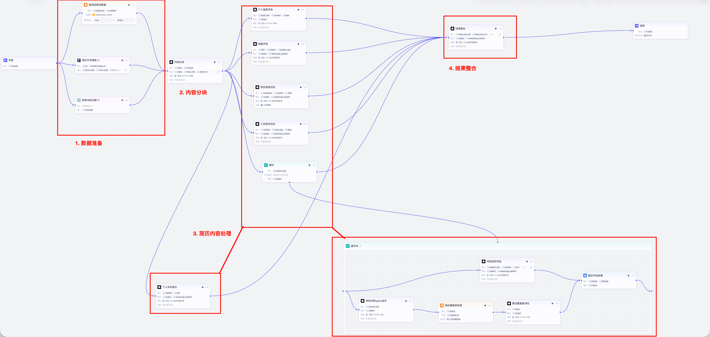
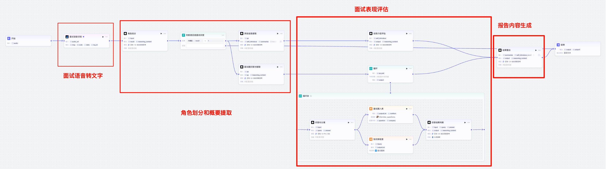
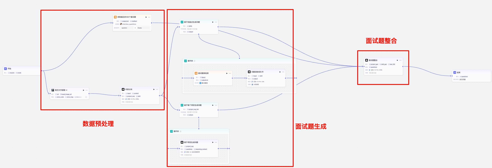

# Day06 Coze 项目案例：AI 面试助手讲义

## 今日学习路线

今天进入 Coze 项目案例：AI 面试助手。今天不是单独学习某一个按钮，而是学习如何把智能体、工作流、知识库、数据库、循环结构、大模型节点组合成一个真实项目。

今天重点完成三件事：

1. 看懂 AI 面试助手这个项目为什么要做。
2. 看懂 AI 面试助手的整体业务流程和架构。
3. 重点理解简历评估模块怎么从一份简历生成一份评估报告。

## 一、项目背景

AI 面试助手是为了解决就业辅导中的效率问题。

学生在就业阶段会遇到几个典型问题：

1. 简历初稿质量不稳定。
2. 面试录音人工复盘成本高。
3. 面试题太多，学生抓不住重点。
4. 老师批量处理多份简历和录音时效率压力大。

所以项目规划了几个模块：

1. 简历修改模块。
2. 面试录音分析模块。
3. 面试题生成模块。
4. 批量处理模块。

今天重点体验简历修改模块。

## 二、AI 面试助手整体流程

看图要点：

1. 左侧是用户入口，学生可以上传简历或录音，老师可以批量上传材料。
2. 中间是面试助手路由中心，先判断用户需求。
3. 业务 Agent 包括简历评估、面试录音分析、面试题生成、批量处理。
4. 底部是数据和知识库支撑，包括违禁词库、简历模板库、真实面试题库、面试宝典、联网搜索结果。
5. 右侧是输出结果，学生和老师看到的是报告，而不是节点细节。

这个图要记住一个核心：智能体不是只靠大模型自己想，而是要依赖业务流程、数据和知识库共同工作。

## 三、项目架构

项目架构可以分成四层。建议从下往上看，不要从上往下硬背名词。

可以把这套架构类比成现代物流供应链：

| 架构层 | 物流类比 | 在项目中的含义 |
|---|---|---|
| 数据与知识层 | 底层大仓库 | 违禁词库、简历模板库、真实面试题库、面试宝典、学生材料 |
| AI 能力支撑层 | 自动化机器设备 | OCR、ASR、RAG、Reranker、数据库读写、联网搜索、大模型推理 |
| 业务应用层 | 核心加工流水线 | 简历评估、录音分析、面试题生成、批量处理 |
| 用户入口层 | 门店、驿站、下单入口 | Coze 应用、豆包、API、微信小程序、公众号、内部系统 |

理解架构时，不要背名词，要看每一层解决什么问题。

用户入口层解决“用户从哪里进来”。

业务应用层解决“用户要做什么事”。

AI 能力支撑层解决“系统靠什么能力完成任务”。

数据与知识层解决“系统依据什么资料来判断”。

更普遍地看，大多数 AI 项目都可以拆成六层：

AI 面试助手是这套通用架构的一个简化案例。真实企业项目通常还会更重视权限、安全、日志、评测、成本监控和人工兜底。

完整架构图讲法和通用 AI 项目类比已经整理在：

`08_Day06_Coze_架构图讲解与通用AI项目架构.md`

## 四、为什么当前阶段选择 Coze

本项目有三种可能的技术路线：

| 技术路线 | 特点 | 适合场景 |
|---|---|---|
| Coze SaaS 版 | 上手快、低代码、适合快速验证 | 课程项目、内部 MVP、时间紧 |
| Dify 或 Coze 本地版 | 可本地部署，数据更安全 | 对数据安全要求高的企业内部项目 |
| LangChain / LangGraph | 扩展性强，可控性高，开发成本高 | 复杂生产级项目、高并发、复杂状态流 |

当前选择 Coze，是因为我们要先快速体验完整项目流程。后续如果项目要接入真实系统、处理高并发、做复杂状态控制，可以考虑 LangGraph。

## 五、单智能体、多智能体和路由

单智能体像一个全能员工，所有事情都自己做。

多智能体像一个团队，不同成员负责不同工作。

路由智能体像前台或调度员，负责判断用户需求，然后把任务分给对应的工作智能体。

在 AI 面试助手中：

1. 用户要改简历，进入简历评估 Agent。
2. 用户要分析录音，进入面试录音分析 Agent。
3. 用户要生成面试题，进入面试题生成 Agent。
4. 老师要批量处理，进入批量处理任务。

多智能体的好处是职责清晰、提示词更好维护、功能之间互相影响更小。

## 六、简历评估模块流程

简历评估模块的输入是一份简历文件，输出是一份简历评估报告。

整体分为五步：

1. 输入与准备：上传简历，准备违禁词库和当前日期。
2. 文本处理：把简历文件转换成文字。
3. 简历内容评估：分别评估个人信息、技能、学历、工作经历、项目经历、个人评价。
4. 结果整合：把各模块评估结果合成完整结论。
5. 输出报告：输出简历优点、存在问题、修改建议、综合评价。

这条流程体现了“分治策略”：先拆开处理，再汇总整合。

## 七、简历评估节点流程

这张图是今天的重点图。

可以按四段理解：

### 1. 数据准备

数据准备包括：

1. 查询违禁词数据。
2. 简历文字提取。
3. 获取当前日期。

违禁词数据库用于检查简历中是否出现不建议直接写的词。

简历文字提取用于把 PDF、Word 或图片简历转成可分析文本。

当前日期用于判断毕业时间、工作年限、项目周期是否合理。

### 2. 内容分块

内容分块是把完整简历拆成可分析的结构化字段。

常见字段包括：

| 字段 | 含义 |
|---|---|
| `name` | 姓名 |
| `base_info` | 基本信息 |
| `skill` | 个人技能 |
| `education` | 教育经历 |
| `work_exp` | 工作经历 |
| `project_exp` | 项目经历 |
| `self` | 个人评价或爱好 |
| `context` | 简历整体总结 |

其中 `project_exp` 要设置成数组，因为一份简历可能有多个项目。

### 3. 多维度简历评估

简历评估不是一个节点从头评到尾，而是多个节点并行评估。

| 评估模块 | 重点 |
|---|---|
| 个人信息评估 | 求职意向、联系方式、期望薪资、工作年限 |
| 技能评估 | 技能是否和项目匹配，熟练掌握是否有项目支撑 |
| 学历评估 | 学校、专业、时间是否完整，位置是否合适 |
| 工作经历评估 | 工作职责是否清楚，是否和项目混写 |
| 项目经历评估 | 项目结构、技术栈、职责、成果、周期、重复度 |
| 自我评价评估 | 是否空泛，是否有事实支撑 |

并行评估可以提高效率，也能让每个节点的提示词更专注。

### 4. 项目经历深度分析

项目经历是重点和难点。

项目可能有多个，所以要用循环逐个处理。

每个项目通常要做：

1. 项目内容评估。
2. 项目 Query 优化。
3. 简历模板库检索。
4. 项目重复度评估。
5. 项目评估结果整合。

项目评估既要看写得好不好，也要看是否和模板高度雷同。

## 八、Coze 简历评估工作流总览

看图要点：

1. 左侧是开始节点和数据准备。
2. 中间是内容分块和多个评估节点。
3. 项目经历部分单独进入循环体。
4. 右侧是结果整合和最终输出。

工作流看起来复杂，但本质只有一句话：

先把简历变成结构化数据，再分别评估每一块，最后整合成报告。

### 全节点阅读入口

简历评估模块一共有 N0 到 N12 的主节点，其中 N9 项目经历循环里还包含 N9a 到 N9e。完整节点说明已经整理在：

`07_Day06_Coze_简历评估全节点说明_修正版.md`

阅读时可以按下面顺序理解：

1. N0 到 N3：准备数据。
2. N4：把简历全文拆成结构化字段。
3. N5、N6、N7、N8、N10：并行评估普通模块。
4. N9：循环评估多个项目。
5. N11：整合所有评估结果。
6. N12：输出 Markdown 报告。

| 节点组 | 解决的问题 |
|---|---|
| 数据准备节点 | 简历文件、违禁词、当前日期从哪里来 |
| 内容分块节点 | 如何把一整份简历拆成可分析字段 |
| 并行评估节点 | 如何分别检查个人信息、技能、学历、工作经历、个人评价 |
| 项目循环节点 | 如何逐个处理数量不固定的项目经历 |
| 结果整合节点 | 如何把散乱评估结果变成完整报告 |

## 九、后续模块预览

简历评估是今天白天的重点。AI 面试助手后续还会继续扩展面试录音分析和面试题生成。

看图要点：

录音分析模块的第一步是把面试音频转成文字，再做角色划分、问题提取、自我介绍评估、问答评估，最后生成分析报告。它的核心是“先把音频变成可分析文本”。

看图要点：

面试题生成模块会结合简历内容、技能点、项目经历和面试题库，生成更贴近个人情况的面试题。它不是随机出题，而是基于学生材料生成专属练习。

## 十、循环结构在项目中的作用

循环适合处理列表数据。

项目经历就是典型列表数据，因为每个人简历里的项目数量不同。

如果项目经历有 3 个，循环就执行 3 次。

如果项目经历有 5 个，循环就执行 5 次。

每次循环处理一个项目，处理逻辑相同。

循环适合这种场景：

1. 数据数量不固定。
2. 每条数据处理规则相同。
3. 最后要把处理结果汇总。

## 十一、简历评估模块中的数据设计

违禁词适合放数据库，因为它是结构化列表，后续要增删改查。

简历模板适合放知识库，因为它是文档资料，需要检索相似内容。

当前日期不需要数据库，只需要插件实时获取。

简历文件不适合直接评估，先要通过文档识别转成文字。

这体现了一个重要原则：不同数据要放在适合的位置。

## 十二、结果整合

结果整合不是简单拼接。

它要把个人信息、技能、学历、工作经历、项目经历、个人评价的结果统一整理，形成一份清晰报告。

好的结果整合应该做到：

1. 结构清楚。
2. 不重复。
3. 不杜撰。
4. 能指出问题。
5. 能给出修改建议。
6. 能让学生知道下一步怎么改。

## 十三、项目收益

这个项目的收益要从业务角度理解。

业务收益包括：

1. 学生可以先自查简历，减少低级错误。
2. 老师可以用系统做初筛，节省批改时间。
3. 问题较多的简历可以先打回修改。
4. 老师可以把精力放在更高级的表达、项目真实性和面试追问上。

技术效果也重要，但不是最终目的。

例如 OCR 准确率、模型效果、检索效果属于技术指标；节省老师时间、提高简历修改效率、提升就业辅导质量才是业务收益。

## 十四、今日自检

1. 我能说清楚 AI 面试助手为什么要做。
2. 我能说出 AI 面试助手的四个模块。
3. 我能解释为什么当前课程阶段先用 Coze。
4. 我能区分知识库和数据库在项目中的作用。
5. 我能说出简历评估模块的五步流程。
6. 我能解释为什么项目经历要用循环。
7. 我能说出结果整合节点的作用。
