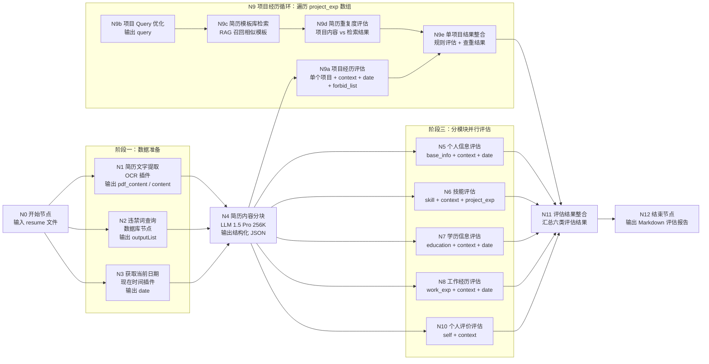
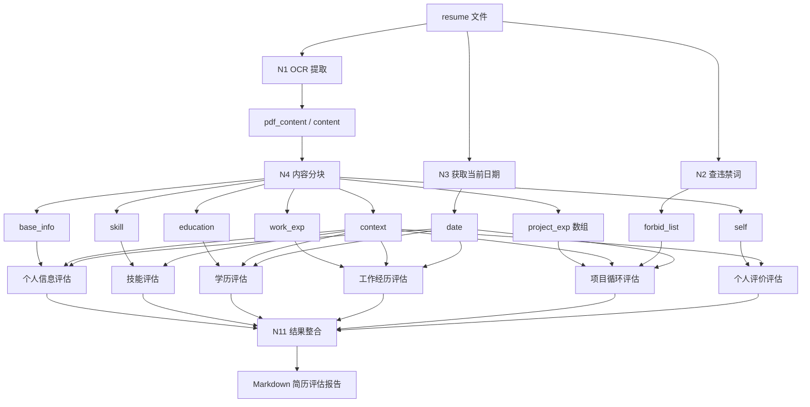

# Day06 Coze 简历评估全节点说明

## 一、模块定位

“简历修改模块”和“简历评估模块”指的是同一条工作流：接收学生上传的 PDF 或 DOC 简历，基于就业辅导规则、违禁词数据库、简历模板知识库和大模型评估能力，输出 Markdown 格式的简历问题清单与修改建议。

这个模块的核心设计思想是：分治、并行、循环、RAG、结果整合。

| 维度 | 说明 |
|---|---|
| 输入 | 简历文件，通常是 PDF 或 DOC |
| 输出 | 简历评估报告，包含问题、风险、修改建议 |
| 核心价值 | 先用系统自查低级错误，再把精力留给更复杂、更有价值的优化问题 |
| 设计思想 | 大任务拆小块，各模块并行评估，项目经历循环处理，最后统一整合 |

## 二、四大阶段

| 阶段 | 做什么 | 为什么 |
|---|---|---|
| 数据准备 | OCR 抽文字、查违禁词、取当前日期 | 为后续评估提供原始材料和时间基准 |
| 内容分块 | 用 LLM 把简历全文拆成多个结构化字段 | 避免整份简历直接评估导致上下文混乱 |
| 分模块评估 | 个人信息、技能、学历、工作经历、项目经历、自我评价分别评估 | 提示词更专注，执行更快，问题更容易定位 |
| 结果整合 | 汇总所有评估结果，生成最终报告 | 让用户看到一份结构清楚、可执行的修改建议 |

## 三、用到的 Coze 组件

| 组件类型 | 在本模块中的用途 | 出现次数 |
|---|---|---|
| 开始节点 | 接收 `resume` 文件 | 1 |
| 插件节点 | 简历文字提取、获取当前日期 | 2 |
| 数据库节点 | 查询违禁词列表 | 1 |
| LLM 节点 | 分块、各模块评估、Query 优化、重复度评估、结果整合 | 多个 |
| 知识库/RAG 节点 | 检索简历模板库，用于项目查重 | 1，位于循环体内 |
| 循环节点 | 遍历 `project_exp` 数组，逐个评估项目 | 1 |
| 结束节点 | 输出 Markdown 报告 | 1 |

## 四、模型选型策略

| 节点 | 建议模型 | 原因 |
|---|---|---|
| 简历内容分块 | 豆包 1.5 Pro 256K | 简历可能较长，需要更大上下文 |
| 个人信息、学历、个人评价 | 豆包 1.5 Pro | 规则相对明确，推理压力较小 |
| 技能、工作经历、项目评估、结果整合 | 豆包 1.6 深度思考 | 需要跨模块推理，规则更多 |
| 学历评估 | 豆包 + 头条搜索 | 需要查询学校信息，降低幻觉 |

## 五、外部数据资源

| 资源 | 类型 | 用途 |
|---|---|---|
| 违禁词数据 | Coze 数据库 | 动态维护不建议出现在简历中的词 |
| 简历模板库 | 知识库/RAG | 项目描述查重和相似内容比对 |
| 当前日期 | 时间插件 | 判断毕业时间、工作年限、项目周期是否合理 |
| 简历文件 | 用户上传文件 | 工作流的原始输入 |

## 六、完整节点清单

| 序号 | 节点名称 | 节点类型 | 所属阶段 |
|---|---|---|---|
| N0 | 开始 | 开始节点 | 入口 |
| N1 | 简历文字提取 | OCR 插件 | 数据准备 |
| N2 | 违禁词查询 | 数据库查询 | 数据准备 |
| N3 | 获取当前日期 | 现在时间插件 | 数据准备 |
| N4 | 简历内容分块 | LLM，256K 上下文 | 内容分块 |
| N5 | 个人信息评估 | LLM | 并行评估 |
| N6 | 技能评估 | LLM，深度思考 | 并行评估 |
| N7 | 学历信息评估 | LLM + 头条搜索 | 并行评估 |
| N8 | 工作经历评估 | LLM，深度思考 | 并行评估 |
| N9 | 项目经历循环 | 循环节点 | 项目评估 |
| N9a | 项目经历评估 | LLM，深度思考 | 循环体内 |
| N9b | 项目内容 Query 优化 | LLM | 循环体内 |
| N9c | 简历模板库检索 | 知识库/RAG | 循环体内 |
| N9d | 简历重复度评估 | LLM | 循环体内 |
| N9e | 单项目结果整合 | 文本整合或 LLM | 循环体内 |
| N10 | 个人评价评估 | LLM | 并行评估 |
| N11 | 评估结果整合 | LLM，深度思考 | 汇总 |
| N12 | 结束 | 结束节点 | 出口 |

## 七、全节点流程图

下面的流程图用来帮助大家从整体上理解节点关系：哪些节点负责准备数据，哪些节点负责分模块评估，哪些节点位于项目经历循环中，最后又如何汇总成完整报告。

## 八、变量传递简图

## 九、分阶段详细说明

### 阶段一：数据准备

#### N0 开始节点

输入：`resume`，文件类型，接收 PDF 或 DOC 简历。

注意：Coze 会把上传文件放到临时存储中，并返回可供插件读取的 URL。

#### N1 简历文字提取

输入：`resume`。

输出：`pdf_content` 或 `content`。

作用：把文件中的简历内容提取为文本。

注意：不同文件类型可能输出到不同字段，所以内容分块节点要同时接收两个字段，并做好兜底。

#### N2 违禁词查询

输入：无固定业务输入。

查询条件：`uuid` 不为空，等价于查询全部违禁词。

输出：`outputList`，也就是违禁词列表。

作用：后续项目经历评估时检查是否出现不建议直接写入简历的词。

#### N3 获取当前日期

输入：无。

输出：日期时间字符串，例如 `2026-06-15 10:30:00`。

作用：判断毕业时间、工作年限、项目周期是否合理，避免大模型只凭自身知识判断当前时间。

### 阶段二：N4 简历内容分块

模型建议：豆包 1.5 Pro 256K。

原因：简历可能比较长，32K 上下文可能不够稳定。

输出字段：

| 字段 | 含义 |
|---|---|
| `name` | 姓名 |
| `base_info` | 求职岗位、薪资、年限、手机、邮箱等 |
| `skill` | IT 技能 |
| `education` | 学历、学校、专业、时间 |
| `work_exp` | 公司、时间、角色、职责 |
| `project_exp` | 项目经历数组，每个项目一个元素 |
| `self` | 个人评价、个人爱好 |
| `context` | 简历全文概括，供后续交叉校验 |

关键提醒：`project_exp` 必须是数组，因为后面要进入循环节点。

### 阶段三：分模块并行评估

并行评估的原因：

1. 每个节点只负责一个模块，提示词更好维护。
2. 多个模块可以同时执行，节省时间。
3. 避免上下文过长导致模型理解质量下降。

#### N5 个人信息评估

输入：`base_info`、`context`、`date`。

检查重点：

1. 不建议写死期望薪资。
2. 求职意向要明确。
3. 邮箱、电话等联系方式要规范。
4. 工作年限要和毕业时间匹配。

#### N6 技能评估

输入：`skill`、`context`、`project_exp`。

检查重点：

1. 技能数量不要只求多。
2. 技能要和项目互相支撑。
3. 项目中出现的核心技术应在技能中体现。
4. “熟练”“掌握”的技术要能被项目证明。

#### N7 学历信息评估

输入：`education`、`context`、`date`。

检查重点：

1. 学历、学校、专业、时间是否完整。
2. 是否需要调整学历位置。
3. 学校信息可结合搜索能力判断，减少幻觉。

#### N8 工作经历评估

输入：`work_exp`、`context`、`date`。

检查重点：

1. 公司、时间、角色是否完整。
2. 工作经历和项目经历是否混写。
3. 工作内容是否和求职方向相关。
4. 工作时间和项目时间是否冲突。

#### N10 个人评价评估

输入：`self`、`context`。

检查重点：

1. 没有个人评价时可以返回空。
2. 有个人评价时不要堆空话。
3. 软素质要有事实支撑。

### 阶段三特殊部分：N9 项目经历循环

项目经历单独用循环，是因为项目数量不固定，内容较长，规则最多，而且还要做 RAG 查重。

循环体内每次处理一个项目。

#### N9a 项目经历评估

输入：单个项目内容、`context`、`date`、`forbid_list`。

检查重点：

1. 项目数量是否合理。
2. 项目是否包含背景、技术栈、职责、成果。
3. 项目周期是否合理。
4. 技术点是否和岗位方向匹配。
5. 是否出现违禁词。
6. 成果数据是否容易解释。

输出建议：JSON，便于循环结束后合并，比 Markdown 更省 token。

#### N9b 项目内容 Query 优化

输入：单个项目内容。

输出：适合检索的 query。

作用：把项目内容按背景、技术点、业务流程、个人职责、优化点、成果数据重新组织，提升知识库检索质量。

注意：只能整理已有信息，不能添加不存在的内容。

#### N9c 简历模板库检索

输入：N9b 输出的 query。

输出：模板库中相似的项目内容。

建议配置：

1. 召回数量可以较高，例如 20 条。
2. 最小匹配度可设置较高，例如 0.85。
3. 开启查询改写和结果重排。

#### N9d 简历重复度评估

输入：当前项目内容和知识库检索结果。

作用：判断当前项目与模板库是否在技术点、业务流程、个人职责、优化点、成果数据上高度雷同。

#### N9e 单项目结果整合

输入：N9a 项目规则评估结果，N9d 项目重复度评估结果。

输出：当前项目的综合评估结果。

作用：把“写得好不好”和“是否雷同”合在一起，形成单个项目的最终结论。

### 阶段四：N11 评估结果整合

输入：

1. 个人信息评估结果。
2. 技能评估结果。
3. 学历评估结果。
4. 工作经历评估结果。
5. 项目经历循环结果。
6. 个人评价评估结果。

作用：

1. 统一口吻。
2. 去掉重复问题。
3. 按 Markdown 结构输出。
4. 生成完整简历评估报告。

注意：结果整合只能基于前面节点的评估结果，不要杜撰新问题。

### 阶段五：N12 结束节点

输出：完整 Markdown 简历评估报告。

调试建议：使用真实或模拟简历试运行，并根据输出问题反向调整内容分块和各评估节点的提示词。

## 十、推荐搭建顺序

1. 创建违禁词数据库，导入违禁词。
2. 创建简历模板知识库，导入模板资料。
3. 搭建开始节点、简历文字提取节点和内容分块节点，先跑通主链路。
4. 添加当前日期插件和违禁词查询节点。
5. 逐个添加个人信息、技能、学历、工作经历、个人评价评估节点。
6. 搭建项目经历循环体。
7. 在循环体内添加项目评估、Query 优化、模板库检索、重复度评估和单项目整合。
8. 添加结果整合节点和结束节点。
9. 使用简历样例全链路测试。
10. 根据 bad case 调整提示词和节点配置。

## 十一、学习抓手

学习这条工作流时，可以反复追问自己三个问题：

1. 这个节点的输入是什么？
2. 这个节点的输出是什么？
3. 如果没有这个节点，会出现什么问题？

示例：

没有内容分块，后面评估节点就只能面对一整份简历，容易混乱。

没有循环，多个项目就不能逐个稳定评估。

没有结果整合，用户看到的是一堆散乱结论，而不是一份能照着修改的报告。
