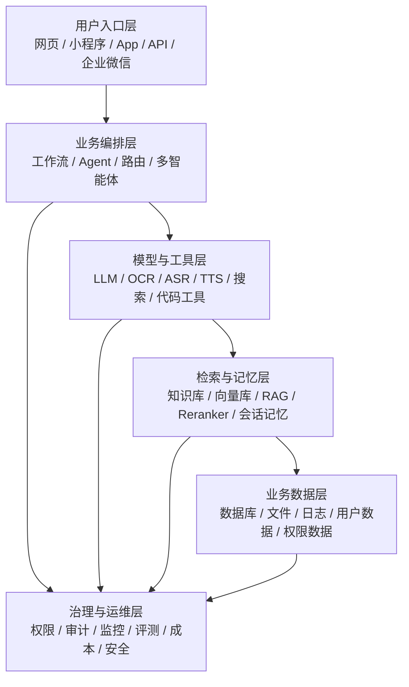

# Day06 Coze 架构图讲解与通用 AI 项目架构

## 一、为什么要讲架构图

第一次看到架构图时，最容易被一堆专业名词吓住：用户入口层、业务应用层、AI 能力支撑层、数据与知识层、RAG、ASR、Reranker、数据库读写等。

讲架构图时不要照着图念名词。更好的方式是从下往上讲：

1. 系统有什么数据。
2. 系统有哪些能力。
3. 业务流程怎么把数据和能力串起来。
4. 用户从哪里进入系统。
5. 最终结果如何返回给用户。

这套思路不只适用于 AI 面试助手，也适用于大部分 AI 应用项目。

## 二、物流供应链类比

可以把 AI 项目类比成现代物流供应链。

数据和知识层像底层大仓库。

AI 能力支撑层像仓库里的自动化设备。

业务应用层像加工流水线。

用户入口层像快递驿站、门店和下单入口。

用户提交需求，就像客户下单。系统接收材料，调用工具处理，查仓库里的资料，经过流水线加工，最后把结果交付给用户。

## 三、AI 面试助手四层架构

### 第一层：数据与知识层

这一层是系统的底层仓库。

在 AI 面试助手中包括：

1. 违禁词数据库。
2. 简历模板知识库。
3. 真实面试题数据库。
4. 面试宝典知识库。
5. 学生简历与录音文件。

这一层解决的是：系统依据什么资料做判断。

没有这一层，智能体只能泛泛回答，容易编造或给出没有依据的建议。

### 第二层：AI 能力支撑层

这一层是自动化设备中心。

在 AI 面试助手中包括：

1. 文档识别 OCR：把简历文件转成文本。
2. 语音识别 ASR：把面试录音转成文字。
3. 知识库检索 RAG：从资料中找相关内容。
4. Reranker：把召回内容重新排序。
5. 数据库读写：查询违禁词、记录处理结果。
6. 联网搜索：补充外部信息。
7. 大模型推理：理解、判断、生成报告。

这一层解决的是：系统靠什么能力完成处理。

大模型不是万能机器，它需要 OCR、ASR、RAG、数据库等工具配合。

### 第三层：业务应用层

这一层是核心加工流水线。

在 AI 面试助手中包括：

1. 简历评估模块。
2. 面试录音分析模块。
3. 面试题生成模块。
4. 批量处理模块。

这一层解决的是：用户具体要做什么业务。

技术组件本身不等于业务。只有把数据、工具和大模型按业务流程串起来，才形成真正的 AI 应用。

### 第四层：用户入口层

这一层是用户接触系统的地方。

在 AI 面试助手中可能包括：

1. Coze 应用。
2. 豆包入口。
3. API。
4. ChatAPI。
5. 微信小程序。
6. 微信公众号。
7. 内部教学系统。

这一层解决的是：用户从哪里使用系统。

用户不关心底层有多少节点，只关心上传简历以后能否得到清晰、有用的评估报告。

## 四、更普遍的 AI 项目六层架构

AI 面试助手的四层架构可以继续泛化成更普遍的 AI 项目架构。很多真实 AI 项目都可以按下面六层理解。

### 1. 用户入口层

用户入口层解决“用户从哪里进来”。

常见入口：

1. Web 页面。
2. 手机 App。
3. 微信小程序。
4. 企业微信或飞书机器人。
5. API 接口。
6. 后台管理系统。

在面试助手中，学生上传简历的入口就属于这一层。

### 2. 业务编排层

业务编排层解决“任务怎么分步骤完成”。

常见实现：

1. Coze 工作流。
2. Dify 工作流。
3. LangGraph 状态图。
4. 自研后端流程。
5. 多智能体路由。

在面试助手中，简历评估工作流、录音分析工作流、面试题生成工作流都属于这一层。

### 3. 模型与工具层

模型与工具层解决“每一步靠什么能力处理”。

常见能力：

1. 大模型理解和生成。
2. OCR 文档识别。
3. ASR 语音识别。
4. TTS 语音合成。
5. 联网搜索。
6. 数据库读写工具。
7. 文件解析工具。

在面试助手中，OCR 把简历转文本，ASR 把录音转文字，大模型负责评估和生成报告。

### 4. 检索与记忆层

检索与记忆层解决“模型依据什么资料回答”和“系统记住什么”。

常见组成：

1. 知识库。
2. 向量数据库。
3. RAG 检索。
4. Reranker 重排。
5. 会话记忆。
6. 用户历史记录。

在面试助手中，简历模板知识库、面试宝典知识库、真实面试题库都属于这一层。

### 5. 业务数据层

业务数据层解决“系统有哪些结构化业务数据”。

常见数据：

1. 用户信息。
2. 订单记录。
3. 简历记录。
4. 评分结果。
5. 违禁词列表。
6. 调用日志。

在面试助手中，违禁词数据库、学生简历记录、评估结果记录都属于这一层。

### 6. 治理与运维层

治理与运维层解决“系统上线后是否安全、稳定、可控”。

常见内容：

1. 权限控制。
2. 数据脱敏。
3. 日志审计。
4. 质量评测。
5. 成本监控。
6. 异常报警。
7. Prompt 版本管理。
8. 人工审核机制。

在当前项目中，这一层不会做得很重，但真实工作里非常重要。因为公司不只关心功能能不能跑，还关心数据是否安全、成本是否可控、结果是否可靠。

## 五、用同一套架构理解不同 AI 项目

### 例子 1：AI 客服助手

| 层级 | 对应内容 |
|---|---|
| 用户入口层 | 官网聊天窗口、企业微信、公众号 |
| 业务编排层 | 意图识别、售前咨询、售后工单、转人工 |
| 模型与工具层 | 大模型、订单查询工具、工单创建工具 |
| 检索与记忆层 | 产品知识库、售后政策、历史对话 |
| 业务数据层 | 用户订单、物流状态、退款记录 |
| 治理与运维层 | 敏感话术拦截、服务质量评估、人工兜底 |

### 例子 2：企业知识库助手

| 层级 | 对应内容 |
|---|---|
| 用户入口层 | 企业微信机器人、内部网页 |
| 业务编排层 | 问题改写、知识检索、答案生成、引用展示 |
| 模型与工具层 | 大模型、文档解析、搜索工具 |
| 检索与记忆层 | 公司制度知识库、项目文档向量库 |
| 业务数据层 | 员工权限、部门信息、文档元数据 |
| 治理与运维层 | 权限隔离、引用溯源、回答评测 |

### 例子 3：AI 数据分析助手

| 层级 | 对应内容 |
|---|---|
| 用户入口层 | BI 页面、内部后台、聊天窗口 |
| 业务编排层 | 理解问题、生成 SQL、执行查询、解释图表 |
| 模型与工具层 | 大模型、SQL 执行器、图表生成工具 |
| 检索与记忆层 | 指标口径知识库、数据字典 |
| 业务数据层 | 业务数据库、数据仓库、报表数据 |
| 治理与运维层 | SQL 权限、慢查询控制、数据脱敏 |

## 六、架构图阅读方法

阅读架构图时，可以按下面顺序理解：

架构图不要从上往下硬背，可以从下往上看。

先看数据与知识层。没有数据，大模型就是空脑袋。

再看 AI 能力支撑层。大模型不是万能的，它需要 OCR 看文档，需要 ASR 听录音，需要 RAG 查资料，需要数据库读写业务数据。

再看业务应用层。真正的项目不是技术堆叠，而是把能力组合成简历评估、录音分析、面试题生成这些业务模块。

最后看用户入口层。用户不关心底层怎么跑，只关心能不能上传材料、拿到结果。

这就是一个 AI 项目的基本思路：底下有数据，中间有能力，上面有业务，最上面有入口，旁边还要有安全、权限、监控和评测。

## 七、需要记住的结论

1. 架构图不是用来背名词的，而是用来看系统怎么分层协作的。
2. AI 项目不是只有大模型，还需要数据、工具、检索、业务流程和治理。
3. 当前 Coze 项目是一个简化版架构，适合学习和验证 MVP。
4. 真实项目会更重视权限、安全、日志、评测、成本和稳定性。
5. 以后讲项目时，不要只说“我用了 Coze 工作流”，要能说清楚入口、业务、能力、数据和收益。
