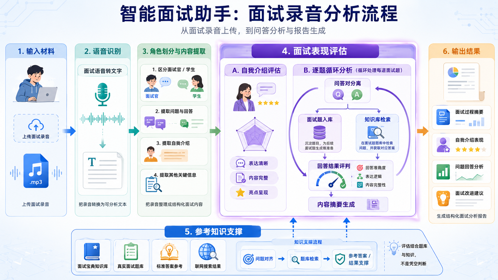
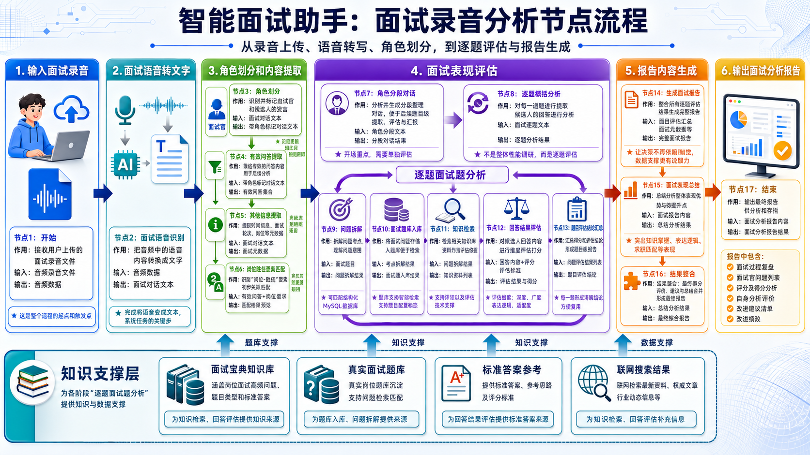
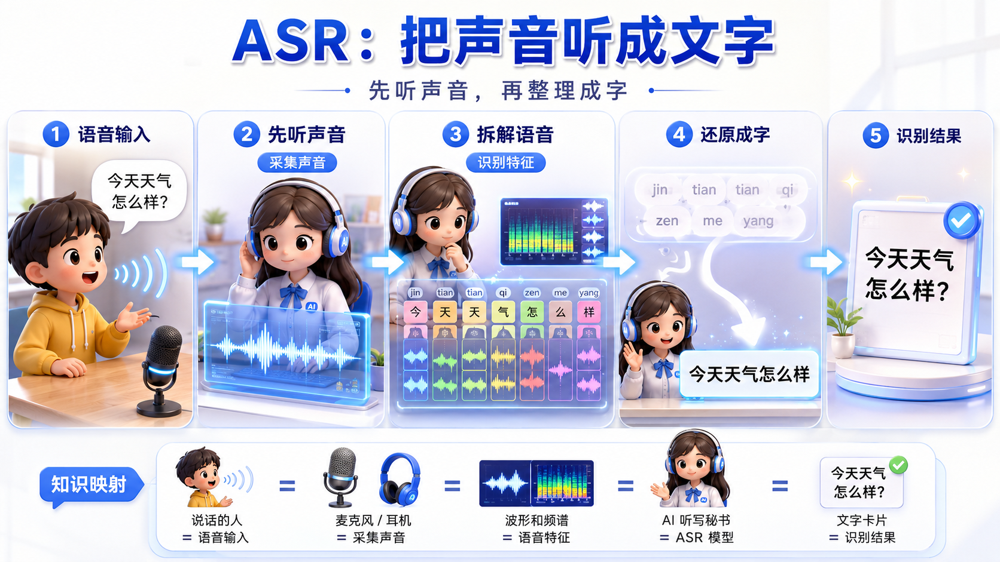
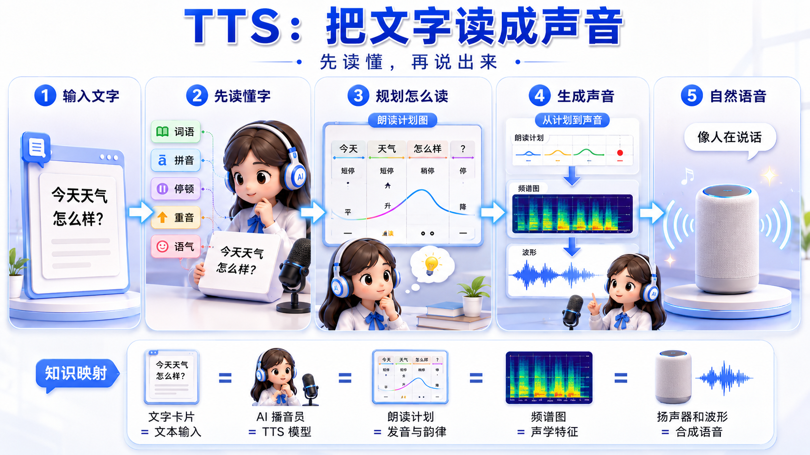
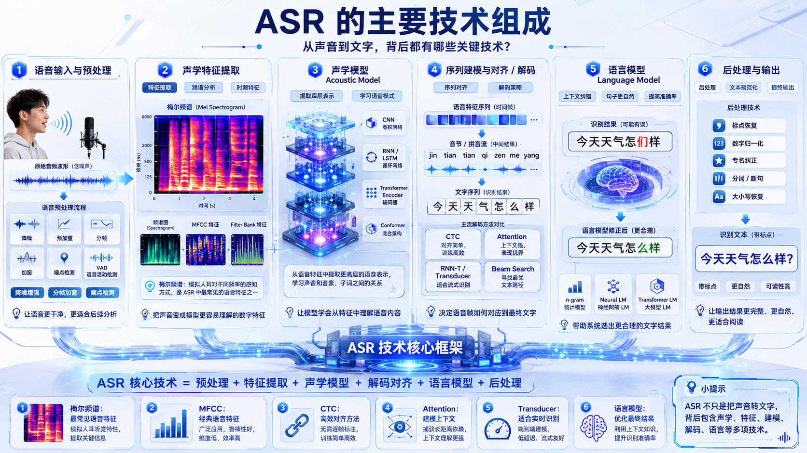
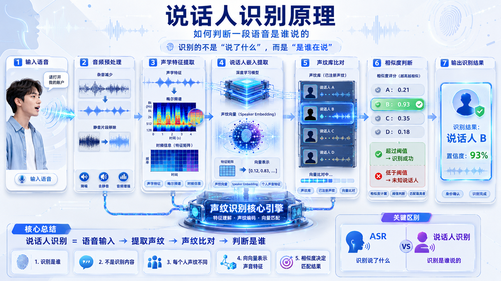
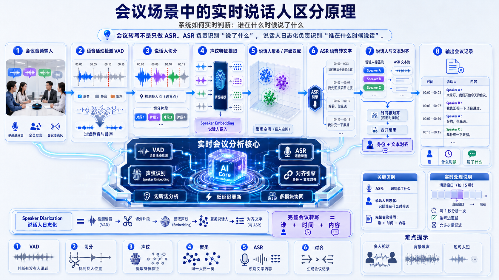
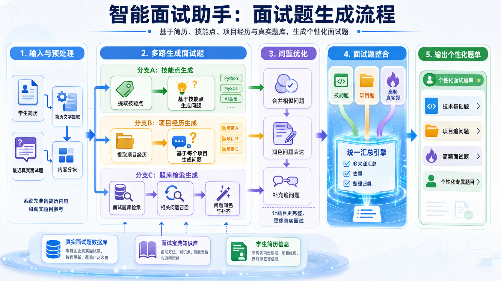
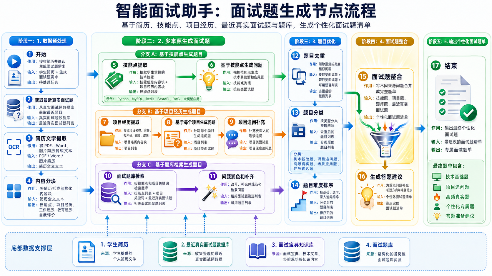

# Day07 Coze AI 面试助手项目讲义

## 一、从单模块到完整 AI 面试助手

前面已经完成了简历评估模块。简历评估能回答一个问题：这份简历哪里需要改。

今天继续扩展项目，让 AI 面试助手可以回答更多问题：

1. 面试录音能不能自动复盘？
2. 简历能不能自动生成针对性的面试题？
3. 多个工作流能不能放到一个智能体入口里？
4. 大量简历和录音能不能批量处理？

这一天的主线是：

```text
简历评估
  ↓
录音分析
  ↓
面试题生成
  ↓
Agent 统一入口
  ↓
API / 批处理
```

## 二、录音分析模块

### 1. 录音分析流程



这张图要看的是“面试录音如何变成复盘报告”。

流程可以拆成五段：

1. 用户上传面试录音。
2. ASR 把声音转成文字。
3. 大模型做角色划分和内容提取。
4. 系统对自我介绍和每道问答进行评估。
5. 最后生成面试复盘报告。

这里最重要的不是“录音转文字”，而是转文字之后还能继续分析：谁在问、谁在答、答得怎样、怎么改。

### 2. 录音分析节点



这张图要看的是 Coze 工作流里的节点关系。

可以按四层理解：

1. 输入层：接收音频。
2. 转写层：ASR 转文字。
3. 结构化层：角色划分、自我介绍提取、问答对提取。
4. 评估层：自我介绍评估、逐题循环评估、报告生成。

这张图中的核心难点是循环结构。因为一场面试里问题数量不固定，所以系统不能写死处理 3 道题、5 道题，而是要对问答数组逐个循环。

## 三、ASR、TTS 和说话人识别

### 1. ASR：把声音听成文字



ASR 解决的问题是：把语音变成文字。

在本项目中，ASR 的输入是面试录音，输出是一段文本。

注意：

1. 面试录音时间较长，超时时间要调大。
2. 面试内容有很多专业词，建议选择大模型版本 ASR。
3. ASR 只负责“说了什么”，不一定能分清“谁说的”。

### 2. TTS：把文字读成声音



TTS 是 ASR 的反方向：把文字变成语音。

本节课主要使用 ASR，TTS 只需要理解概念。以后如果做 AI 面试官，让系统自动读题、追问、播报反馈，就可能会用到 TTS。

### 3. ASR 的主要技术组成



完整 ASR 系统通常包含声音预处理、特征提取、声学模型、语言模型、解码和后处理。

在 Coze 中，这些细节已经被插件封装起来。我们不需要自己训练 ASR 模型，但要知道插件背后做了什么，这样调试时才知道错误可能来自哪里。

### 4. 说话人识别



说话人识别解决的问题是：这段声音是谁说的。

它和 ASR 不同：

1. ASR 看内容。
2. 说话人识别看声音特征。

在多人会议中，说话人识别很重要；但在面试场景里，通常只有面试官和应试者两个角色，可以先使用语义分角色方案。

### 5. 会议场景中的说话人区分



会议场景更复杂，需要处理多人、抢话、时间戳对齐等问题。

面试场景相对简单，所以本项目选择：

1. 先用 ASR 得到文本。
2. 再用大模型根据语义划分面试官和应试者。

这是一种更轻量的实现方式，适合当前项目阶段。

## 四、角色划分与概要提取

### 1. 角色划分

角色划分节点要把 ASR 文本整理成清晰的面试对话。

目标格式：

```text
面试官：请你介绍一下 RAG 的流程。
应试者：RAG 一般包括文档切分、向量化、检索和答案生成……
```

关键要求：

1. 保留原始对话内容。
2. 标清面试官和应试者。
3. 如果不是面试录音，直接拦截，不继续分析。
4. 对卡顿、停顿、明显异常可以保留标记。

### 2. 概要提取

概要提取节点主要输出：

1. 自我介绍原文。
2. 面试整体总结。

自我介绍只指开场阶段的自我介绍，不包括后面面试官追问“介绍一下项目”时的回答。

### 3. 问答对提取

问答对提取是为了后续逐题评估。

示例：

```text
问题：RAG 中为什么需要向量检索？
回答：因为用户的问题和原文不一定完全一致，向量检索可以按语义相似度找到相关内容。
```

注意：

1. 问题要尽量完整。
2. 追问要补充上下文。
3. 自我介绍不要混入普通问答。
4. 输出字符串数组更稳定。

## 五、面试表现评估

### 1. 自我介绍评估

自我介绍评估主要看：

1. 内容是否完整。
2. 项目是否讲清楚。
3. 技能是否堆砌。
4. 表达是否过长。
5. 是否用事实证明能力。

好的自我介绍不是“我很努力、我很负责”，而是用项目事实证明：

```text
我在知识库问答项目中负责文档清洗和召回优化，通过调整切分粒度和重排策略，让回答引用更稳定。
```

### 2. 问答结果评估

问答结果评估使用循环结构：

1. 取出一个问答对。
2. 拆分问题和回答。
3. 用问题检索知识库。
4. 同时把问题写入题库。
5. 根据知识库或互联网答案评估回答。
6. 输出 A/B/C/D 等级和改进建议。
7. 继续处理下一道题。

这个流程的关键是：每一道题都单独评估，而不是整段录音一起笼统评价。

### 3. RAG 和联网兜底

如果知识库能查到答案，就优先使用知识库。

如果知识库查不到，系统可以使用互联网搜索作为兜底。

这样做的原因是：

1. 避免模型凭空判断。
2. 提高回答评估的依据性。
3. 让报告更像真实面试官反馈。

### 4. 面试题入库

每次从录音里提取出真实面试问题，都可以写入数据库。

这样题库会不断积累，后续生成面试题和评估回答时都能复用。

这体现了真实产品中的数据积累思路。

## 六、面试题生成模块

### 1. 面试题生成流程



面试题生成模块的输入是简历，输出是一组模拟面试题。

它要做三件事：

1. 从简历中提取技能点和项目经历。
2. 结合题库和知识库生成技术题。
3. 根据项目经历生成项目追问题。

### 2. 面试题生成节点



这张图要重点看两个循环：

1. 技能点循环：每个技能点生成对应技术题。
2. 项目经历循环：每个项目生成对应项目追问。

技能题可以依赖题库和知识库。

项目题更个性化，通常要根据简历项目内容直接生成。

### 3. 为什么要拆细技能点

如果简历写：

```text
熟悉 RAG、Agent、向量数据库、Transformer 和 PyTorch。
```

系统不能直接按整句话生成一道题，而应该拆成：

1. RAG。
2. Agent。
3. 向量数据库。
4. Transformer。
5. PyTorch。

拆细之后，题目才更精准。

### 4. 项目追问应该问什么

项目追问不能只问“你做了什么”，还要问：

1. 项目背景是否真实。
2. 技术选型为什么这样选。
3. 个人职责是否清楚。
4. 难点是什么。
5. 优化怎么做。
6. 指标怎么算。
7. 有没有替代方案。

这类问题更接近真实面试。

## 七、智能体编排

智能体编排的目标是把多个工作流合并成一个入口。

用户不需要知道背后有几个工作流，只需要告诉智能体自己要做什么：

1. 上传简历并说“帮我看看简历”：调用简历评估。
2. 上传录音：调用录音分析。
3. 上传简历并说“帮我生成面试题”：调用面试题生成。

Agent 的核心不是“会聊天”，而是能根据用户意图选择正确工具。

## 八、批处理与 API 调用

批处理用于处理大量文件。

基本思路：

1. 遍历文件夹。
2. 找到符合格式的简历或录音。
3. 上传文件。
4. 调用已经发布的智能体。
5. 接收结果。
6. 保存为 Markdown 文件。

这一步的意义是让 Coze 项目更接近真实工作：网页上手动点一次只是演示，通过 API 批量调用才更像业务系统。

## 九、自检清单

学完今天后，可以用下面的问题检查自己：

1. ASR 和说话人识别有什么区别？
2. 为什么录音分析要先角色划分，再提取问答对？
3. 为什么问答评估要用循环？
4. RAG 在面试回答评估中起什么作用？
5. 为什么要把真实面试题入库？
6. 面试题生成为什么要拆技能点？
7. Agent 编排解决了什么问题？
8. 批处理和 API 调用为什么更接近真实工作？
