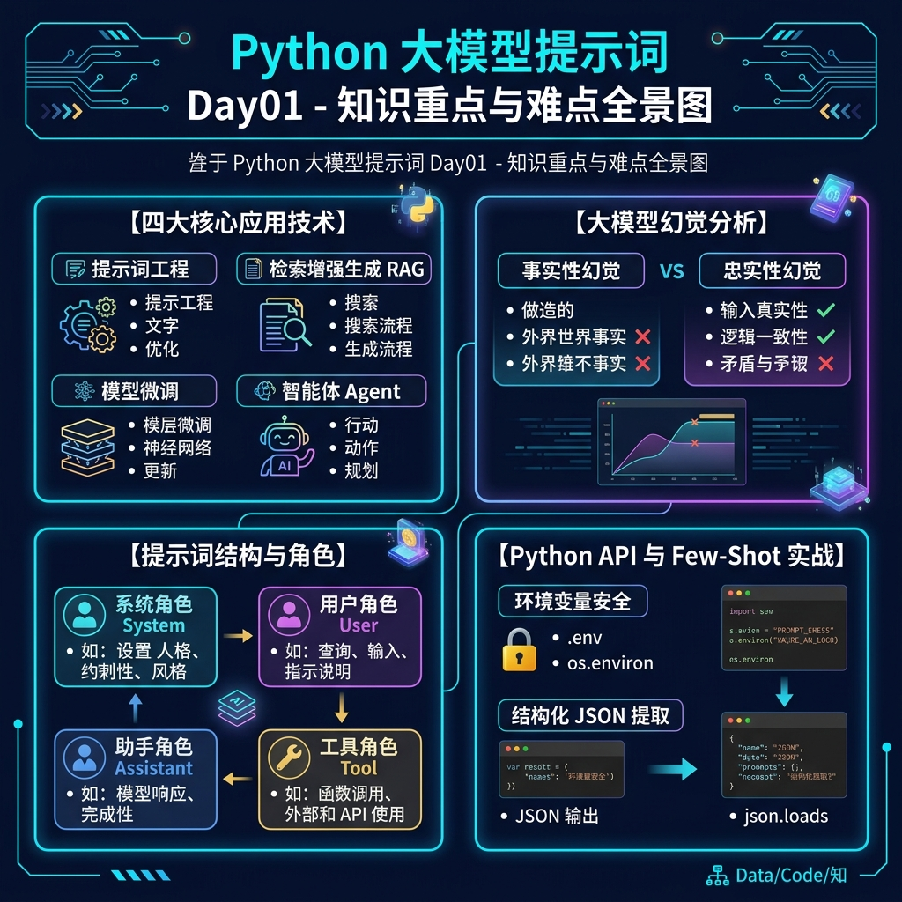

# Python 大模型提示词 Day01 知识重点与难点全景解析



---

## 📌 一、 核心知识架构全景

基于 [Day01_讲义.md](file:///c:/Users/YuEth/Desktop/AI%E7%BB%BC%E5%90%88%E5%AD%A6%E4%B9%A0%E6%96%B9%E6%A1%88/%E6%8A%80%E6%9C%AF%E8%B7%AF%E7%BA%BF/Machine-learning-learning/prompt/04_%E8%B5%84%E6%96%99/Day01/Day01_%E8%AE%B2%E4%B9%89.md) 的内容，第一天的学习建立了大模型应用开发的**整体技术图谱**与**基础调用能力**，涵盖从底层原理、幻觉治理、四大技术选型到 Prompt 构造及 Python 代码实战。

```mermaid
flowchart TD
    AI[大模型基础与底层] --> Hallucination[大模型幻觉治理]
    AI --> TechStack[四大应用开发技术]
    
    TechStack --> Prompt[1. 提示词工程 Prompt]
    TechStack --> RAG[2. 检索增强生成 RAG]
    TechStack --> FT[3. 模型微调 Fine-Tuning]
    TechStack --> Agent[4. 智能体 Agent]

    Prompt --> Roles[Messages 角色划分: system/user/assistant/tool]
    Prompt --> FewShot[Few-Shot 提示词实战: 结构化抽取]
    
    Prompt --> PythonAPI[Python API 调用实操]
    PythonAPI --> KeySec[环境变量与 Key 安全]
    PythonAPI --> Parse[OpenAI 兼容对象解析: choices[0].message.content]
```

---

## 🌟 二、 今日知识重点 (Key Points)

> **重点**是工作中频繁使用、面试必考、编写代码必须掌握的基础核心。

### 1. 大模型应用四大技术栈的分工与配合
* **提示词工程 (Prompt Engineering)**：把任务与边界约束说清楚。解决模型“乱回答、不听话、格式不规范”。成本最低、见效最快。
* **RAG (检索增强生成)**：外挂知识库（类比**开卷考试**）。解决“大模型知识过时、企业内部私有数据缺失”。
* **微调 (Fine-Tuning)**：对模型进行二次训练（类比**回炉深造**）。提升模型在特定垂直领域的长期稳定表达与能力。
* **Agent (智能体)**：模型负责思考决策，程序负责调用工具（类比**智能管家**）。解决“大模型无法直接查天气、查数据库、执行 API 动作”的问题。

### 2. 提示词结构与大模型输入角色 (`messages`)
* **Prompt ≠ 仅用户单句提问**：真实工程中，提示词包含角色、背景、规则、上下文资料、示例与格式要求。
* **四大核心角色 (Roles)**：
  * `system`：定义模型的身份、全局规则、回答边界与输出规范。
  * `user`：用户本次输入的任务或问题。
  * `assistant`：模型的历史回答或开发者预设的示例 (Few-Shot)。
  * `tool`：外部工具执行后返回给模型的结构化数据。

### 3. Few-Shot 示例引导结构化输出 (JSON 提取实战)
* 在 API 的 `messages` 中，通过构造 `user` 样例输入与 `assistant` 样例输出，教导模型严格按 JSON 格式返回数据（如快递单中姓名、手机号、地址的无干扰提取）。

### 4. OpenAI 兼容 API 调用的核心标准代码路径
* **安全最佳实践**：API Key 统一由环境变量 `os.getenv("OPENAI_API_KEY")` 读取，禁止硬编码。
* **结果提取路径**：
  ```python
  completion.choices[0].message.content
  ```

---

## 🎯 三、 今日知识难点 (Difficult Points)

> **难点**是概念容易混淆、技术选型模糊或在实际工程中容易引发 Bug 的地方。

### 1. 幻觉的双重类型辨析与治理策略 (Factuality vs Faithfulness)
* **难点表现**：以为幻觉只是“模型说假话”，不知道如何针对性治理。
* **深度剖析**：
  * ❌ **事实性幻觉 (Factuality)**：生成的回答违背真实世界客观事实（如把别人的歌说成周杰伦唱的）。
    * *治理方案*：增加 **RAG (检索增强生成)** 或实时搜索工具，提供权威参考资料。
  * ❌ **忠实性幻觉 (Faithfulness)**：生成的回答违背了用户给定的上下文或指令限制（如要求只输出 JSON，模型却输出了一大段解释文字）。
    * *治理方案*：优化 **Prompt 工程**（明确规则、Few-Shot 示范、Structured Output 约束）。

### 2. Prompt / RAG / 微调 / Agent 的技术选型决策边界
* **难点表现**：面对业务需求时，混淆何时该写 Prompt、何时该搭 RAG、何时必须微调。
* **决策对照指南**：

| 业务痛点场景 | 推荐技术 | 选型原因 |
|---|---|---|
| 输出格式不稳定、缺少边界约束 | **Prompt 工程** | 成本最低，调整 Prompt 规则即可解决 |
| 需要回答最新的企业内部文档/知识库 | **RAG** | 随时更新知识库，无需重新训练模型 |
| 需要长期、稳定地具备特定语言/代码/领域风格 | **微调** | 固化垂直能力，减少 Prompt 长度 |
| 需要查询实时数据（天气、股票、数据库）或执行操作 | **Agent** | 大模型自身不能执行操作，需靠 Agent 调度工具 |

### 3. Few-Shot 示例在代码 SDK 中的“伪造”与传参逻辑
* **难点表现**：初学者难以理解为什么没有真实对话时，`messages` 列表里也要写 `assistant` 角色。
* **深度剖析**：
  在发送 API 请求时，`messages` 列表中的 `user` 与 `assistant` 组合不仅用于“记录历史对话”，更重要地是被用作**上下文学习 (In-Context Learning)** 的示例。通过人工注入一条伪造的 `assistant` 示范文本，可以大幅度提升模型格式遵循的准确率（99% 以上稳定输出合法 JSON）。

---

## 💡 四、 避坑指南 (今日易错点总结)

1. ⚠️ **API Key 泄露**：切勿将 `api_key="sk-xxx"` 直接写入 `.py` 文件提交至 Git。
2. ⚠️ **Prompt 狭隘理解**：不要认为 Prompt 就是用户输入的那句话，Prompt = 规则 + 背景 + 资料 + 示例 + 问题。
3. ⚠️ **盲目微调**：能用 Prompt 和 RAG 解决的问题，不要轻易去微调模型（微调成本高、周期长、易出现灾难性遗忘）。
